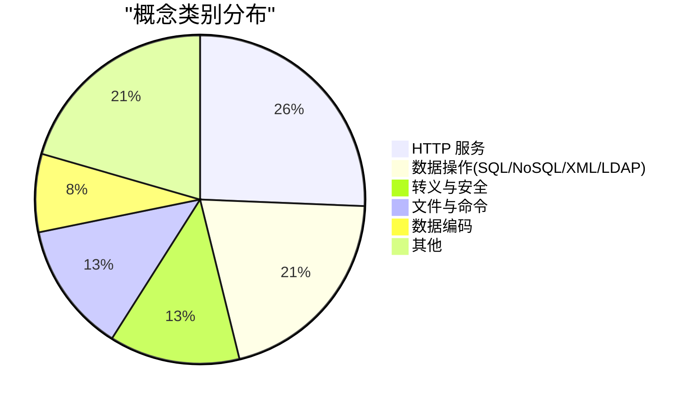
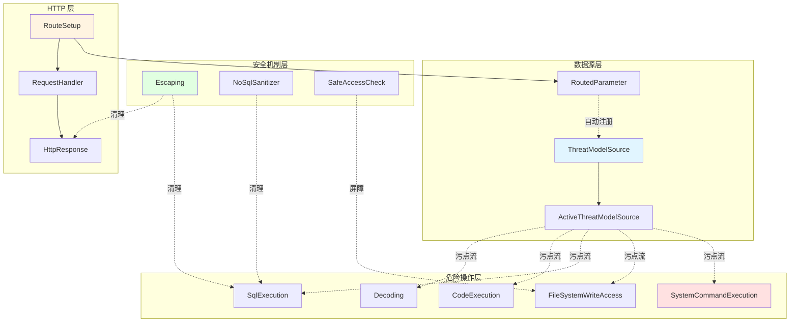
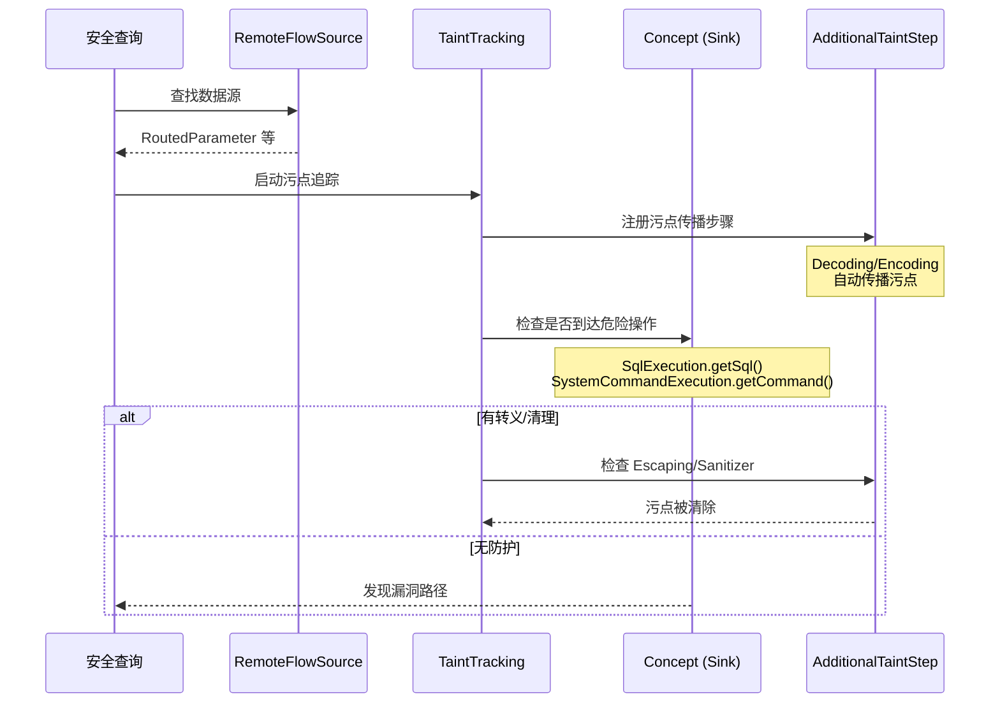
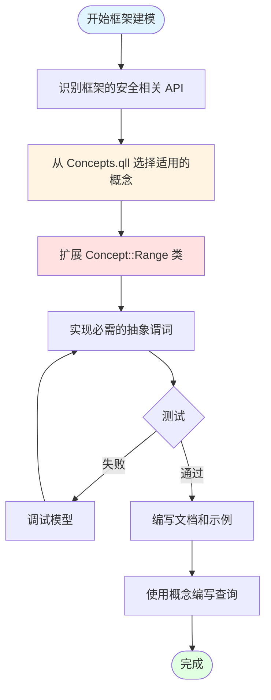

# CodeQL Python Concepts.qll 架构分析

## 目录

1. [概述](#概述)
2. [设计理念](#设计理念)
3. [概念清单](#概念清单)
4. [详细概念分析](#详细概念分析)
5. [架构图](#架构图)
6. [最佳实践](#最佳实践)
7. [实现示例](#实现示例)

---

## 概述

### Concepts.qll 的作用

`Concepts.qll` 是 CodeQL Python 标准库中的核心文件,定义了**框架无关的安全概念抽象类**。这些概念类为跨框架的安全漏洞检测提供了统一的接口。

**核心价值:**
- 📦 **抽象层**: 将安全概念(如命令执行、SQL注入)与具体框架实现解耦
- 🔄 **可复用性**: 安全查询可以基于概念编写,自动支持所有实现该概念的框架
- 🎯 **一致性**: 确保不同框架的安全检测使用相同的语义和标准
- 🚀 **扩展性**: 新框架只需实现对应概念的 Range 类即可复用现有查询

**文件路径**: `codeql/python/ql/lib/semmle/python/Concepts.qll`

### 架构原理

```
┌─────────────────────────────────────────────┐
│          Security Queries                    │
│   (基于概念编写,框架无关)                      │
└─────────────────┬───────────────────────────┘
                  │ 使用
┌─────────────────▼───────────────────────────┐
│          Concepts.qll                        │
│   抽象安全概念定义(SystemCommandExecution等)   │
└─────────────────┬───────────────────────────┘
                  │ 继承/实现
┌─────────────────▼───────────────────────────┐
│      Framework Modeling Files                │
│   (Flask.qll, Django.qll 等)                 │
│   实现具体框架的概念 Range 类                   │
└──────────────────────────────────────────────┘
```

---

## 设计理念

### 1. 双层类设计模式 (Concept + Range)

Concepts.qll 采用独特的**双层类设计**:

```ql
class SystemCommandExecution extends DataFlow::Node instanceof SystemCommandExecution::Range {
  DataFlow::Node getCommand() { result = super.getCommand() }
}

module SystemCommandExecution {
  abstract class Range extends DataFlow::Node {
    abstract DataFlow::Node getCommand();
  }
}
```

**设计动机:**

| 层级 | 类名 | 用途 | 扩展场景 |
|------|------|------|----------|
| 外层 | `SystemCommandExecution` | 查询使用的统一接口 | **重新定义现有 API** (罕见) |
| 内层 | `SystemCommandExecution::Range` | 框架实现的扩展点 | **建模新的框架 API** (常见) |

**好处:**
- ✅ 避免多个框架建模冲突
- ✅ 清晰的扩展点标识
- ✅ 保持查询接口稳定

### 2. 与数据流集成

所有概念类都扩展 `DataFlow::Node`,无缝集成到数据流和污点追踪分析中:

```ql
class Decoding extends DataFlow::Node instanceof Decoding::Range {
  DataFlow::Node getAnInput() { result = super.getAnInput() }
  DataFlow::Node getOutput() { result = super.getOutput() }
}

// 自动注册污点传播步骤
private class DecodingAdditionalTaintStep extends TaintTracking::AdditionalTaintStep {
  override predicate step(DataFlow::Node nodeFrom, DataFlow::Node nodeTo, string model) {
    exists(Decoding decoding |
      nodeFrom = decoding.getAnInput() and
      nodeTo = decoding.getOutput() and
      model = "Decoding-" + decoding.getFormat()
    )
  }
}
```

### 3. 威胁模型驱动

通过 `ThreatModelSource` 和 `ActiveThreatModelSource`,支持可配置的威胁模型:

```ql
class ActiveThreatModelSource extends ThreatModelSource {
  ActiveThreatModelSource() {
    exists(string kind |
      currentThreatModel(kind) and
      this.getThreatModel() = kind
    )
  }
}
```

允许用户根据场景(如 remote、database、environment)选择性启用数据源。

### 4. 语义明确的谓词命名

概念类使用清晰的谓词名称,表达安全语义:

- `getCommand()` - 获取要执行的命令
- `getSql()` - 获取 SQL 语句
- `mayExecuteInput()` - 是否可能执行输入数据
- `isShellInterpreted()` - 是否通过 shell 解释
- `vulnerableTo(kind)` - 是否存在特定类型的漏洞

---

## 概念清单

### 完整概念列表

| 序号 | 概念类 | 类别 | 用途 | 关键方法 |
|------|--------|------|------|----------|
| 1 | `ThreatModelSource` | 数据源 | 特定威胁模型的数据源 | `getThreatModel()`, `getSourceType()` |
| 2 | `ActiveThreatModelSource` | 数据源 | 当前激活的威胁模型源 | - |
| 3 | `SystemCommandExecution` | 命令执行 | 操作系统命令执行 | `getCommand()`, `isShellInterpreted()` |
| 4 | `FileSystemAccess` | 文件操作 | 文件系统访问(读/写/权限等) | `getAPathArgument()` |
| 5 | `FileSystemWriteAccess` | 文件操作 | 文件系统写入操作 | `getADataNode()`, `getAPathArgument()` |
| 6 | `Path::PathNormalization` | 路径处理 | 路径规范化 | `getPathArg()` |
| 7 | `Path::SafeAccessCheck` | 路径处理 | 路径安全性检查 | `checks(node, branch)` |
| 8 | `Decoding` | 数据编码 | 反序列化/解码/解压/解密 | `getAnInput()`, `getOutput()`, `getFormat()`, `mayExecuteInput()` |
| 9 | `Encoding` | 数据编码 | 序列化/编码/压缩/加密 | `getAnInput()`, `getOutput()`, `getFormat()` |
| 10 | `Logging` | 日志记录 | 日志输出 | `getAnInput()` |
| 11 | `CodeExecution` | 代码执行 | 动态执行 Python 代码 | `getCode()` |
| 12 | `SqlConstruction` | SQL 操作 | SQL 语句构造 | `getSql()` |
| 13 | `SqlExecution` | SQL 操作 | SQL 语句执行 | `getSql()` |
| 14 | `NoSqlExecution` | NoSQL 操作 | NoSQL 查询执行 | `getQuery()`, `interpretsDict()`, `vulnerableToStrings()` |
| 15 | `NoSqlSanitizer` | NoSQL 操作 | NoSQL 查询清理 | `getAnInput()` |
| 16 | `RegexExecution` | 正则表达式 | 正则表达式执行 | `getRegex()`, `getString()`, `getName()` |
| 17 | `RegExpInterpretation` | 正则表达式 | 字符串解释为正则表达式 | - |
| 18 | `XML::XPathConstruction` | XML 操作 | XPath 表达式构造 | `getXPath()`, `getName()` |
| 19 | `XML::XPathExecution` | XML 操作 | XPath 表达式执行 | `getXPath()`, `getName()` |
| 20 | `XML::XmlParsing` | XML 操作 | XML 解析 | `vulnerableTo(kind)` |
| 21 | `Ldap::LdapExecution` | LDAP 操作 | LDAP 查询执行 | `getFilter()`, `getBaseDn()` |
| 22 | `Escaping` | 转义 | 元字符转义(防注入) | `getAnInput()`, `getOutput()`, `getKind()` |
| 23 | `HtmlEscaping` | 转义 | HTML 转义 | - |
| 24 | `XmlEscaping` | 转义 | XML 转义 | - |
| 25 | `RegexEscaping` | 转义 | 正则表达式转义 | - |
| 26 | `LdapDnEscaping` | 转义 | LDAP DN 转义 | - |
| 27 | `LdapFilterEscaping` | 转义 | LDAP 过滤器转义 | - |
| 28 | `TemplateConstruction` | 模板 | 模板引擎构造 | `getSourceArg()` |
| 29 | `Http::Server::RouteSetup` | HTTP 服务 | HTTP 路由设置 | `getUrlPattern()`, `getARequestHandler()`, `getARoutedParameter()` |
| 30 | `Http::Server::RequestHandler` | HTTP 服务 | HTTP 请求处理器 | `getARoutedParameter()`, `getFramework()` |
| 31 | `Http::Server::HttpResponse` | HTTP 服务 | HTTP 响应创建 | `getBody()`, `getMimetype()` |
| 32 | `Http::Server::HttpRedirectResponse` | HTTP 服务 | HTTP 重定向响应 | `getRedirectLocation()` |
| 33 | `Http::Server::ResponseHeaderWrite` | HTTP 服务 | HTTP 响应头设置 | `getNameArg()`, `getValueArg()`, `nameAllowsNewline()` |
| 34 | `Http::Server::ResponseHeaderBulkWrite` | HTTP 服务 | HTTP 批量响应头设置 | `getBulkArg()` |
| 35 | `Http::Server::CookieWrite` | HTTP 服务 | Cookie 设置 | `getNameArg()`, `getValueArg()`, `hasSecureFlag()`, `hasHttpOnlyFlag()` |
| 36 | `Http::Server::CorsMiddleware` | HTTP 服务 | CORS 中间件配置 | `getOrigins()`, `getCredentialsAllowed()` |
| 37 | `Http::Server::CsrfProtectionSetting` | HTTP 服务 | 全局 CSRF 保护设置 | `getVerificationSetting()` |
| 38 | `Http::Server::CsrfLocalProtectionSetting` | HTTP 服务 | 局部 CSRF 保护设置 | `getRequestHandler()`, `csrfEnabled()` |
| 39 | `Cryptography::PublicKey::KeyGeneration` | 密码学 | 公钥密码学密钥对生成 | `getName()`, `getKeySizeArg()`, `minimumSecureKeySize()` |

### 概念分类统计



---

## 详细概念分析

### 1. 威胁模型概念

#### 1.1 ThreatModelSource

**用途**: 标识特定威胁模型下的数据源(如远程输入、数据库、环境变量等)

**类继承结构**:
```
DataFlow::Node
  └── ThreatModelSource::Range (抽象)
        └── ThreatModelSource
              └── ActiveThreatModelSource
```

**关键方法**:
```ql
string getThreatModel()  // 返回威胁模型类型: "remote", "database", "environment" 等
string getSourceType()   // 返回数据源类型描述
```

**使用场景**:
- 根据不同威胁模型配置数据源
- 支持可配置的安全扫描策略
- 区分不同风险级别的输入源

**实现约束**:
- 必须实现 `getThreatModel()` 和 `getSourceType()`
- 威胁模型种类参考: `threat-model-grouping.model.yml`

#### 1.2 ActiveThreatModelSource

**用途**: 自动过滤,仅包含当前威胁模型配置中激活的数据源

**实现逻辑**:
```ql
class ActiveThreatModelSource extends ThreatModelSource {
  ActiveThreatModelSource() {
    exists(string kind |
      currentThreatModel(kind) and
      this.getThreatModel() = kind
    )
  }
}
```

**使用场景**: 查询中使用 `ActiveThreatModelSource` 替代 `RemoteFlowSource`,实现威胁模型感知

---

### 2. 命令执行概念

#### 2.1 SystemCommandExecution

**用途**: 检测操作系统命令执行,如进程创建、shell 调用

**类定义**:
```ql
class SystemCommandExecution extends DataFlow::Node instanceof SystemCommandExecution::Range {
  predicate isShellInterpreted(DataFlow::Node arg) { ... }
  DataFlow::Node getCommand() { ... }
}
```

**关键方法**:
- `getCommand()`: 返回指定要执行的命令的参数节点
- `isShellInterpreted(arg)`: 判断参数是否通过 shell 解释(更高风险)

**安全风险**:
- 命令注入 (Command Injection)
- Shell 注入 (Shell Injection)

**框架实现示例** (subprocess 模块):
```ql
class SubprocessCall extends SystemCommandExecution::Range {
  SubprocessCall() {
    this = API::moduleImport("subprocess").getMember(["run", "call", "Popen"]).getACall()
  }

  override DataFlow::Node getCommand() {
    result in [this.getArg(0), this.getArgByName("args")]
  }

  override predicate isShellInterpreted(DataFlow::Node arg) {
    arg = this.getCommand() and
    this.getArgByName("shell").getALocalSource().asExpr().(BooleanLiteral).booleanValue() = true
  }
}
```

**使用场景**:
- 检测命令注入漏洞
- 审计特权命令执行
- 追踪外部程序调用

---

### 3. 文件系统操作概念

#### 3.1 FileSystemAccess

**用途**: 标识文件系统访问操作(读、写、删除、权限修改等)

**关键方法**:
```ql
DataFlow::Node getAPathArgument()  // 返回解释为路径的参数
```

**安全风险**:
- 路径遍历 (Path Traversal)
- 任意文件读取/写入

**继承层次**:
```
FileSystemAccess
  └── FileSystemWriteAccess (专门的写入操作)
```

#### 3.2 FileSystemWriteAccess

**用途**: 专门追踪写入文件系统的操作

**扩展方法**:
```ql
DataFlow::Node getADataNode()  // 返回要写入的数据节点
```

**使用场景**:
- 检测任意文件写入漏洞
- 追踪配置文件篡改
- 审计日志写入操作

#### 3.3 Path 模块

**子概念**:

##### Path::PathNormalization
- **用途**: 路径规范化操作(如 `os.path.normpath`)
- **方法**: `getPathArg()` - 获取被规范化的路径参数
- **作用**: 标识安全路径处理实践

##### Path::SafeAccessCheck
- **用途**: 路径安全性验证(如前缀检查)
- **类型**: `DataFlow::BarrierGuard` - 自动注册为数据流屏障
- **方法**: `checks(node, branch)` - 判断节点在特定分支是否安全
- **作用**: 减少路径遍历的误报

---

### 4. 数据编码/解码概念

#### 4.1 Decoding

**用途**: 标识数据解码操作,包括:
- 反序列化 (pickle.loads, json.loads)
- 解压缩 (gzip.decompress)
- 解密 (AES.decrypt)
- 解码 (base64.decode)

**关键方法**:
```ql
predicate mayExecuteInput()       // 是否可能执行输入数据(如 pickle)
DataFlow::Node getAnInput()       // 获取输入数据节点
DataFlow::Node getOutput()        // 获取解码后的输出节点
string getFormat()                // 返回格式标识: "JSON", "XML", "pickle" 等
```

**自动污点传播**:
```ql
private class DecodingAdditionalTaintStep extends TaintTracking::AdditionalTaintStep {
  override predicate step(DataFlow::Node nodeFrom, DataFlow::Node nodeTo, string model) {
    exists(Decoding decoding |
      nodeFrom = decoding.getAnInput() and
      nodeTo = decoding.getOutput() and
      model = "Decoding-" + decoding.getFormat()
    )
  }
}
```

**安全风险**:
- 反序列化代码执行 (pickle)
- XML 外部实体注入 (XXE)
- DoS 攻击 (XML bomb)

**使用场景**:
- 检测不安全反序列化
- 追踪数据转换流程
- 标识潜在 DoS 点

#### 4.2 Encoding

**用途**: 标识数据编码操作(序列化、压缩、加密、编码)

**关键方法**:
```ql
DataFlow::Node getAnInput()
DataFlow::Node getOutput()
string getFormat()
```

**污点传播**: 同 Decoding,自动注册 `EncodingAdditionalTaintStep`

**使用场景**:
- 追踪敏感数据编码
- 验证加密实现
- 审计序列化点

---

### 5. SQL/NoSQL 操作概念

#### 5.1 SqlConstruction vs SqlExecution

**概念区分**:

| 概念 | 用途 | 使用时机 | 示例 API |
|------|------|----------|----------|
| `SqlConstruction` | SQL 语句**构造** | 构造本身即风险 | `"SELECT * FROM " + table` |
| `SqlExecution` | SQL 语句**执行** | 需要确认执行 | `cursor.execute(sql)` |

**方法**:
```ql
DataFlow::Node getSql()  // 获取 SQL 语句参数
```

**查询选择建议**:
- **SQL 注入检测**: 优先使用 `SqlExecution`(确保代码可达)
- **代码审计**: 使用 `SqlConstruction`(覆盖更广)

#### 5.2 NoSqlExecution

**用途**: NoSQL 数据库查询执行(MongoDB, Redis 等)

**特殊谓词**:
```ql
predicate interpretsDict()        // 是否解包字典(如 MongoDB 的 $where)
predicate vulnerableToStrings()   // 字符串查询是否危险
```

**安全风险**:
- NoSQL 注入
- JavaScript 代码执行 (MongoDB $where)

#### 5.3 NoSqlSanitizer

**用途**: 标识 NoSQL 查询清理函数

**方法**:
```ql
DataFlow::Node getAnInput()  // 获取被清理的查询输入
```

**作用**: 在污点分析中自动注册为清理节点,减少误报

---

### 6. XML 操作概念

#### 6.1 XmlParsing

**用途**: XML 解析操作,扩展自 `Decoding`

**特殊方法**:
```ql
predicate vulnerableTo(XmlParsingVulnerabilityKind kind)
```

**漏洞类型**:
```ql
class XmlParsingVulnerabilityKind extends string {
  XmlParsingVulnerabilityKind() {
    this in ["XML bomb", "XXE", "DTD retrieval"]
  }
}
```

**使用场景**:
- 检测 XXE 漏洞
- 识别 XML bomb 风险
- 审计 DTD 外部实体加载

#### 6.2 XPathConstruction / XPathExecution

**用途**: XPath 表达式构造和执行

**方法**:
```ql
DataFlow::Node getXPath()
string getName()  // 返回方法名,用于告警消息
```

**安全风险**: XPath 注入

---

### 7. 转义概念

#### 7.1 Escaping (基础类)

**用途**: 标识元字符转义操作,用于防御注入攻击

**关键方法**:
```ql
DataFlow::Node getAnInput()   // 获取输入数据
DataFlow::Node getOutput()    // 获取转义后的输出
string getKind()              // 返回转义类型: "html", "xml", "regex", "ldap_dn", "ldap_filter"
```

**验证逻辑**:
```ql
Escaping() {
  // 必须同时定义输入和输出才有效
  exists(super.getAnInput()) and
  exists(super.getOutput())
}
```

#### 7.2 专用转义类

| 类名 | Kind | 用途 |
|------|------|------|
| `HtmlEscaping` | `"html"` | HTML 内容转义 (`&lt;`, `&gt;` 等) |
| `XmlEscaping` | `"xml"` | XML 内容转义 |
| `RegexEscaping` | `"regex"` | 正则表达式元字符转义 |
| `LdapDnEscaping` | `"ldap_dn"` | LDAP DN 转义 |
| `LdapFilterEscaping` | `"ldap_filter"` | LDAP 过滤器转义 |

**使用场景**:
- 验证正确使用转义函数
- 在污点分析中注册清理步骤
- 检测转义遗漏的注入点

---

### 8. HTTP 服务器概念

#### 8.1 RouteSetup

**用途**: HTTP 路由配置(URL 模式到处理函数的映射)

**关键方法**:
```ql
string getUrlPattern()                   // 获取 URL 模式: "/users/<id>"
Function getARequestHandler()            // 获取请求处理函数
Parameter getARoutedParameter()          // 获取路由参数(自动成为 RemoteFlowSource)
string getFramework()                    // 返回框架名称: "Flask", "Django" 等
```

**自动远程流源注册**:
```ql
private class RoutedParameter extends RemoteFlowSource::Range {
  RoutedParameter() {
    this.getParameter() = handler.getARoutedParameter()
  }
  override string getSourceType() {
    result = handler.getFramework() + " RoutedParameter"
  }
}
```

**Flask 实现示例**:
```ql
class FlaskRouteSetup extends RouteSetup::Range {
  FlaskRouteSetup() {
    this = Flask::flask().getMember("route").getACall()
  }

  override string getUrlPattern() {
    result = this.getArg(0).getALocalSource().asExpr().(StringLiteral).getText()
  }

  override Function getARequestHandler() {
    result = this.getADecoratedFunction()
  }

  override Parameter getARoutedParameter() {
    exists(string name |
      this.getUrlPattern().regexpFind("<([^>]+)>", _, _) and
      result = this.getARequestHandler().getArgByName(name)
    )
  }

  override string getFramework() { result = "Flask" }
}
```

#### 8.2 HttpResponse

**用途**: HTTP 响应创建

**关键方法**:
```ql
DataFlow::Node getBody()               // 获取响应体
string getMimetype()                   // 获取 MIME 类型
```

**Range 接口**:
```ql
abstract class Range extends DataFlow::Node {
  abstract DataFlow::Node getBody();
  abstract DataFlow::Node getMimetypeOrContentTypeArg();
  abstract string getMimetypeDefault();

  string getMimetype() {
    // 从参数中提取或使用默认值
  }
}
```

**使用场景**:
- 检测 XSS 漏洞(响应体包含未转义的用户输入)
- 验证 Content-Type 正确性
- 追踪敏感数据泄露

#### 8.3 CookieWrite

**用途**: Cookie 设置操作

**关键方法**:
```ql
DataFlow::Node getNameArg()            // Cookie 名称
DataFlow::Node getValueArg()           // Cookie 值
DataFlow::Node getHeaderArg()          // 原始 Set-Cookie 头
predicate hasSecureFlag(boolean b)     // Secure 标志状态
predicate hasHttpOnlyFlag(boolean b)   // HttpOnly 标志状态
predicate hasSameSiteAttribute(SameSiteValue v)  // SameSite 属性
predicate isSensitive()                // 是否包含敏感信息
```

**安全检查**:
```ql
// 检测缺少 Secure 标志的敏感 Cookie
from CookieWrite cookie
where cookie.isSensitive() and
      cookie.hasSecureFlag(false)
select cookie, "Sensitive cookie without Secure flag"
```

#### 8.4 CsrfProtectionSetting

**用途**: CSRF 保护配置

**类型**:
- `CsrfProtectionSetting`: 全局配置
- `CsrfLocalProtectionSetting`: 局部配置(特定路由)

**方法**:
```ql
// 全局
boolean getVerificationSetting()

// 局部
Function getRequestHandler()
predicate csrfEnabled()
```

**使用场景**: 检测 CSRF 保护缺失或被禁用

---

### 9. 密码学概念

#### 9.1 Cryptography::PublicKey::KeyGeneration

**用途**: 公钥密码学密钥对生成

**关键方法**:
```ql
string getName()                                    // 算法名称: "RSA", "DSA", "ECC"
DataFlow::Node getKeySizeArg()                      // 密钥大小参数
int getKeySizeWithOrigin(DataFlow::Node origin)     // 追溯密钥大小来源
int minimumSecureKeySize()                          // 最小安全密钥大小
```

**预定义范围类**:
```ql
abstract class RsaRange extends Range {
  override string getName() { result = "RSA" }
  override int minimumSecureKeySize() { result = 2048 }
}

abstract class DsaRange extends Range {
  override int minimumSecureKeySize() { result = 2048 }
}

abstract class EccRange extends Range {
  override int minimumSecureKeySize() { result = 224 }
}
```

**安全检查**:
```ql
from Cryptography::PublicKey::KeyGeneration keygen, int size
where size = keygen.getKeySizeWithOrigin(_) and
      size < keygen.minimumSecureKeySize()
select keygen, "Weak key size: " + size + " bits (minimum: " + keygen.minimumSecureKeySize() + ")"
```

---

## 架构图

### 1. 类继承层次图

```mermaid
classDiagram
    class DataFlowNode["DataFlow::Node"] {
        <<interface>>
    }

    %% 威胁模型
    class ThreatModelSource {
        +getThreatModel() string
        +getSourceType() string
    }
    class ActiveThreatModelSource {
        <<filter>>
    }

    %% 命令和文件
    class SystemCommandExecution {
        +getCommand() DataFlow::Node
        +isShellInterpreted(arg) bool
    }
    class FileSystemAccess {
        +getAPathArgument() DataFlow::Node
    }
    class FileSystemWriteAccess {
        +getADataNode() DataFlow::Node
    }

    %% 编码
    class Decoding {
        +getAnInput() DataFlow::Node
        +getOutput() DataFlow::Node
        +getFormat() string
        +mayExecuteInput() bool
    }
    class Encoding {
        +getAnInput() DataFlow::Node
        +getOutput() DataFlow::Node
        +getFormat() string
    }

    %% SQL
    class SqlConstruction {
        +getSql() DataFlow::Node
    }
    class SqlExecution {
        +getSql() DataFlow::Node
    }

    %% HTTP
    class RouteSetup {
        +getUrlPattern() string
        +getARequestHandler() Function
        +getFramework() string
    }
    class HttpResponse {
        +getBody() DataFlow::Node
        +getMimetype() string
    }
    class HttpRedirectResponse {
        +getRedirectLocation() DataFlow::Node
    }
    class CookieWrite {
        +getNameArg() DataFlow::Node
        +hasSecureFlag(b) bool
        +hasHttpOnlyFlag(b) bool
    }

    %% 转义
    class Escaping {
        +getAnInput() DataFlow::Node
        +getOutput() DataFlow::Node
        +getKind() string
    }
    class HtmlEscaping
    class XmlEscaping

    %% 关系
    DataFlowNode <|-- ThreatModelSource
    ThreatModelSource <|-- ActiveThreatModelSource
    DataFlowNode <|-- SystemCommandExecution
    DataFlowNode <|-- FileSystemAccess
    FileSystemAccess <|-- FileSystemWriteAccess
    DataFlowNode <|-- Decoding
    DataFlowNode <|-- Encoding
    DataFlowNode <|-- SqlConstruction
    DataFlowNode <|-- SqlExecution
    DataFlowNode <|-- RouteSetup
    DataFlowNode <|-- HttpResponse
    HttpResponse <|-- HttpRedirectResponse
    DataFlowNode <|-- CookieWrite
    DataFlowNode <|-- Escaping
    Escaping <|-- HtmlEscaping
    Escaping <|-- XmlEscaping
```



### 2. 概念间关系图



### 3. 数据流集成图



### 4. 框架实现工作流程



---

## 最佳实践

### 1. 何时扩展 Range vs 概念类

| 场景 | 扩展目标 | 原因 |
|------|----------|------|
| **为新框架建模 API** | `Concept::Range` | 标准场景,避免与其他框架冲突 |
| **细化现有框架模型** | `Concept::Range` | 扩展相同框架的更多 API |
| **重新定义概念语义** | `Concept` | 非常罕见,可能破坏现有查询 |
| **添加辅助谓词** | `Concept` | 为查询提供便利方法(不改变语义) |

**推荐模式**:
```ql
// ✅ 正确: 扩展 Range 建模新框架
class MyFrameworkSqlExec extends SqlExecution::Range {
  MyFrameworkSqlExec() {
    this = API::moduleImport("myframework").getMember("execute_sql").getACall()
  }

  override DataFlow::Node getSql() {
    result = this.getArg(0)
  }
}

// ❌ 错误: 直接扩展概念类
class MyFrameworkSqlExec extends SqlExecution {
  // 会与其他框架的建模冲突!
}
```

### 2. 实现概念的常见模式

#### 模式 1: API 调用建模
```ql
class PickleLoads extends Decoding::Range {
  PickleLoads() {
    this = API::moduleImport("pickle").getMember("loads").getACall()
  }

  override predicate mayExecuteInput() { any() }
  override DataFlow::Node getAnInput() { result = this.getArg(0) }
  override DataFlow::Node getOutput() { result = this }
  override string getFormat() { result = "pickle" }
}
```

#### 模式 2: 方法调用建模
```ql
class CursorExecute extends SqlExecution::Range {
  CursorExecute() {
    exists(API::Node cursor |
      cursor = API::moduleImport("sqlite3").getMember("connect").getReturn().getMember("cursor").getReturn() |
      this = cursor.getMember("execute").getACall()
    )
  }

  override DataFlow::Node getSql() {
    result = this.getArg(0)
  }
}
```

#### 模式 3: 装饰器建模
```ql
class FlaskRoute extends RouteSetup::Range {
  FlaskRoute() {
    this = Flask::flask().getMember("route").getACall()
  }

  override Function getARequestHandler() {
    result = this.getADecoratedFunction()
  }

  override string getUrlPattern() {
    result = this.getArg(0).getALocalSource().asExpr().(StringLiteral).getText()
  }
}
```

### 3. 与数据流和污点追踪集成

#### 集成检查清单:
- ✅ 概念类继承自 `DataFlow::Node`
- ✅ 输入/输出谓词返回 `DataFlow::Node` 类型
- ✅ 需要时实现 `AdditionalTaintStep`
- ✅ 清理/屏障使用 `TaintTracking::Sanitizer` 或 `DataFlow::BarrierGuard`

#### 自动污点传播示例:
```ql
// Decoding 自动传播污点
private class DecodingAdditionalTaintStep extends TaintTracking::AdditionalTaintStep {
  override predicate step(DataFlow::Node nodeFrom, DataFlow::Node nodeTo, string model) {
    exists(Decoding decoding |
      nodeFrom = decoding.getAnInput() and
      nodeTo = decoding.getOutput() and
      model = "Decoding-" + decoding.getFormat()
    )
  }
}
```

#### 屏障守卫示例:
```ql
class SafeAccessCheck extends DataFlow::ExprNode {
  SafeAccessCheck() {
    this = DataFlow::BarrierGuard<safeAccessCheck/3>::getABarrierNode()
  }
}

private predicate safeAccessCheck(DataFlow::GuardNode g, ControlFlowNode node, boolean branch) {
  g.(SafeAccessCheck::Range).checks(node, branch)
}
```

### 4. 测试策略

#### 4.1 单元测试模式
```ql
// tests/MyFramework/SqlExecution.ql
import python
import semmle.python.Concepts

from SqlExecution exec
where exec.getLocation().getFile().getRelativePath().matches("%test%")
select exec, exec.getSql()
```

**测试数据库**:
```python
# test.py
import myframework

# 预期检测到
myframework.execute_sql(user_input)  # 应该被标记为 SqlExecution

# 预期忽略
myframework.execute_sql("SELECT 1")  # 硬编码,低风险
```

#### 4.2 端到端测试
```ql
// tests/SqlInjection.ql
import python
import semmle.python.dataflow.new.TaintTracking
import semmle.python.Concepts

class SqlInjectionConfig extends TaintTracking::Configuration {
  SqlInjectionConfig() { this = "SqlInjection" }

  override predicate isSource(DataFlow::Node source) {
    source instanceof RemoteFlowSource
  }

  override predicate isSink(DataFlow::Node sink) {
    exists(SqlExecution exec | sink = exec.getSql())
  }
}

from SqlInjectionConfig config, DataFlow::PathNode source, DataFlow::PathNode sink
where config.hasFlowPath(source, sink)
select sink.getNode(), source, sink, "SQL injection from $@", source.getNode(), "user input"
```

### 5. 常见陷阱和解决方案

#### 陷阱 1: 忘记实现所有必需谓词
```ql
// ❌ 错误: 缺少 getFormat()
class MyDecoding extends Decoding::Range {
  override DataFlow::Node getAnInput() { ... }
  override DataFlow::Node getOutput() { ... }
  override predicate mayExecuteInput() { ... }
  // 缺少: override string getFormat() { ... }
}
```

**解决**: 检查抽象类的所有 `abstract` 谓词

#### 陷阱 2: 构造谓词过于宽泛
```ql
// ❌ 错误: 匹配所有函数调用
class MyExec extends SqlExecution::Range {
  MyExec() {
    this instanceof DataFlow::CallCfgNode  // 太宽泛!
  }
}

// ✅ 正确: 精确匹配特定 API
class MyExec extends SqlExecution::Range {
  MyExec() {
    this = API::moduleImport("mydb").getMember("execute").getACall()
  }
}
```

#### 陷阱 3: 数据流节点类型不匹配
```ql
// ❌ 错误: 返回 Expr 而非 DataFlow::Node
override DataFlow::Node getSql() {
  result = this.getArg(0).asExpr()  // asExpr() 返回 Expr,类型错误!
}

// ✅ 正确: 返回 DataFlow::Node
override DataFlow::Node getSql() {
  result = this.getArg(0)  // 直接返回 DataFlow::Node
}
```

---

## 实现示例

### 示例 1: Flask 框架的 RouteSetup 实现

```ql
/**
 * Flask 路由设置建模
 * 文件: codeql/python/ql/lib/semmle/python/frameworks/Flask.qll
 */
private class FlaskRouteSetup extends Http::Server::RouteSetup::Range {
  DataFlow::CallCfgNode decoratorCall;

  FlaskRouteSetup() {
    // 匹配 @app.route(...) 装饰器调用
    decoratorCall.getFunction().(DataFlow::AttrRead).getObject() = flask() and
    decoratorCall.getFunction().(DataFlow::AttrRead).getAttributeName() in ["route", "add_url_rule"]
  }

  override DataFlow::Node getUrlPatternArg() {
    // URL 模式是第一个参数
    result = decoratorCall.getArg(0)
  }

  override Function getARequestHandler() {
    // 被装饰的函数是请求处理器
    result = decoratorCall.getADecoratedFunction()
  }

  override Parameter getARoutedParameter() {
    // 提取 URL 模式中的参数,如 /users/<user_id>
    exists(string name, string pattern |
      pattern = this.getUrlPattern() and
      pattern.regexpCapture(".*<(?:([^:>]+):)?([^>]+)>.*", 2) = name and
      result = this.getARequestHandler().getArgByName(name)
    )
  }

  override string getFramework() { result = "Flask" }
}
```

**对应的 Flask 代码**:
```python
from flask import Flask, request
app = Flask(__name__)

@app.route('/users/<user_id>')  # FlaskRouteSetup 检测到此装饰器
def get_user(user_id):           # user_id 成为 RoutedParameter (RemoteFlowSource)
    # user_id 自动被标记为远程流源
    sql = f"SELECT * FROM users WHERE id = {user_id}"  # 检测到 SQL 注入
    return execute_sql(sql)
```

### 示例 2: Pickle 反序列化建模

```ql
/**
 * Pickle 不安全反序列化建模
 */
private class PickleLoads extends Decoding::Range {
  PickleLoads() {
    this = API::moduleImport("pickle").getMember(["loads", "load"]).getACall()
  }

  override predicate mayExecuteInput() {
    // pickle 可以执行任意代码!
    any()
  }

  override DataFlow::Node getAnInput() {
    result = this.getArg(0)
  }

  override DataFlow::Node getOutput() {
    result = this
  }

  override string getFormat() {
    result = "pickle"
  }
}
```

**检测查询**:
```ql
/**
 * @name Unsafe pickle deserialization
 * @kind path-problem
 */
import python
import semmle.python.dataflow.new.TaintTracking
import semmle.python.Concepts

class UnsafePickleConfig extends TaintTracking::Configuration {
  UnsafePickleConfig() { this = "UnsafePickle" }

  override predicate isSource(DataFlow::Node source) {
    source instanceof RemoteFlowSource
  }

  override predicate isSink(DataFlow::Node sink) {
    exists(Decoding decoding |
      decoding.mayExecuteInput() and
      decoding.getFormat() = "pickle" and
      sink = decoding.getAnInput()
    )
  }
}

from UnsafePickleConfig config, DataFlow::PathNode source, DataFlow::PathNode sink
where config.hasFlowPath(source, sink)
select sink.getNode(), source, sink,
  "Unsafe deserialization of $@ using pickle.",
  source.getNode(), "user-controlled data"
```

### 示例 3: Django SQL 执行建模

```ql
/**
 * Django raw SQL 执行建模
 */
private class DjangoRawSql extends SqlExecution::Range {
  DjangoRawSql() {
    exists(API::Node manager |
      // Manager.raw() 方法
      manager = djangoModel().getReturn().getMember("objects") and
      this = manager.getMember("raw").getACall()
      or
      // connection.cursor().execute()
      this = API::moduleImport("django.db").getMember("connection")
        .getMember("cursor").getReturn()
        .getMember("execute").getACall()
    )
  }

  override DataFlow::Node getSql() {
    result = this.getArg(0)
  }
}
```

**对应的 Django 代码**:
```python
from django.db import connection
from myapp.models import User

# 场景 1: Manager.raw()
users = User.objects.raw(
    f"SELECT * FROM users WHERE name = '{user_input}'"  # SQL 注入
)

# 场景 2: cursor.execute()
with connection.cursor() as cursor:
    cursor.execute(
        f"SELECT * FROM users WHERE id = {user_id}"  # SQL 注入
    )
```

### 示例 4: HTML 转义建模

```ql
/**
 * MarkupSafe HTML 转义建模
 */
private class MarkupSafeEscape extends Escaping::Range {
  MarkupSafeEscape() {
    this = API::moduleImport("markupsafe").getMember("escape").getACall()
  }

  override DataFlow::Node getAnInput() {
    result = this.getArg(0)
  }

  override DataFlow::Node getOutput() {
    result = this
  }

  override string getKind() {
    result = Escaping::getHtmlKind()  // "html"
  }
}
```

**在污点分析中作为清理节点**:
```ql
class XssConfig extends TaintTracking::Configuration {
  // ...

  override predicate isSanitizer(DataFlow::Node node) {
    // HtmlEscaping 自动阻止污点流
    node = any(HtmlEscaping esc).getOutput()
  }
}
```

### 示例 5: LDAP 注入检测

```ql
/**
 * python-ldap 模块建模
 */
private class PythonLdapExecution extends Ldap::LdapExecution::Range {
  PythonLdapExecution() {
    exists(API::Node conn |
      conn = API::moduleImport("ldap").getMember("initialize").getReturn() and
      this = conn.getMember("search_s").getACall()
    )
  }

  override DataFlow::Node getFilter() {
    // search_s(base, scope, filter, ...)
    result = this.getArg(2)
  }

  override DataFlow::Node getBaseDn() {
    result = this.getArg(0)
  }
}

/**
 * LDAP 过滤器转义建模
 */
private class LdapFilterEscape extends LdapFilterEscaping::Range {
  LdapFilterEscape() {
    this = API::moduleImport("ldap.filter").getMember("escape_filter_chars").getACall()
  }

  override DataFlow::Node getAnInput() { result = this.getArg(0) }
  override DataFlow::Node getOutput() { result = this }
  override string getKind() { result = Escaping::getLdapFilterKind() }
}
```

**检测 LDAP 注入**:
```ql
class LdapInjectionConfig extends TaintTracking::Configuration {
  override predicate isSink(DataFlow::Node sink) {
    exists(Ldap::LdapExecution ldap |
      sink = ldap.getFilter() or
      sink = ldap.getBaseDn()
    )
  }

  override predicate isSanitizer(DataFlow::Node node) {
    node = any(LdapFilterEscaping esc).getOutput() or
    node = any(LdapDnEscaping esc).getOutput()
  }
}
```

---

## 附录

### A. 跨语言概念对比

CodeQL 在不同语言中保持概念一致性:

| 概念 | Python | JavaScript | Java | Go |
|------|--------|------------|------|-----|
| SystemCommandExecution | ✅ | ✅ | ✅ | ✅ |
| SqlExecution | ✅ | ✅ | ✅ | ✅ |
| FileSystemAccess | ✅ | ✅ | ✅ | ✅ |
| HttpServer concepts | ✅ | ✅ | ✅ | ✅ |
| Decoding | ✅ | ✅ | ✅ | ✅ |

**相同点**:
- 核心概念名称一致
- 谓词签名相似
- 设计模式相同 (Concept + Range)

**差异点**:
- 语言特定概念 (如 Python 的 pickle, Java 的反射)
- 框架生态不同 (Python: Flask/Django, Java: Spring)

### B. 相关文件索引

| 文件路径 | 说明 |
|----------|------|
| `semmle/python/Concepts.qll` | 本文档分析的核心文件 |
| `semmle/python/Frameworks.qll` | 框架建模汇总 |
| `semmle/python/frameworks/Flask.qll` | Flask 框架建模 |
| `semmle/python/frameworks/Django.qll` | Django 框架建模 |
| `semmle/python/dataflow/new/RemoteFlowSources.qll` | 远程流源定义 |
| `semmle/python/dataflow/new/TaintTracking.qll` | 污点追踪库 |
| `codeql/threatmodels/ThreatModels.qll` | 威胁模型配置 |

### C. 推荐阅读

1. **CodeQL 官方文档**:
   - [CodeQL for Python](https://codeql.github.com/docs/codeql-language-guides/codeql-for-python/)
   - [Creating queries for Python](https://codeql.github.com/docs/codeql-language-guides/basic-query-for-python-code/)

2. **数据流分析**:
   - [About data flow analysis](https://codeql.github.com/docs/writing-codeql-queries/about-data-flow-analysis/)
   - [Using flow labels](https://codeql.github.com/docs/writing-codeql-queries/using-flow-labels/)

3. **威胁建模**:
   - [Threat models](https://github.com/github/codeql/blob/main/docs/codeql/reusables/threat-model-description.rst)
   - [Threat model grouping](https://github.com/github/codeql/blob/main/shared/threat-models/ext/threat-model-grouping.model.yml)

4. **框架建模指南**:
   - [Modeling frameworks](https://github.com/github/codeql/blob/main/docs/codeql/support/creating-framework-models.md)

---

## 总结

### 关键要点

1. **Concepts.qll 是框架无关的抽象层**,定义了 39 个安全概念,覆盖命令执行、文件操作、SQL/NoSQL、HTTP、密码学等领域

2. **双层设计 (Concept + Range)** 是核心模式:
   - 外层概念类供查询使用
   - 内层 Range 类供框架实现

3. **与数据流深度集成**:
   - 所有概念继承 `DataFlow::Node`
   - 自动注册污点传播步骤
   - 支持屏障守卫和清理节点

4. **威胁模型驱动**:
   - 通过 `ThreatModelSource` 支持可配置的数据源
   - 使用 `ActiveThreatModelSource` 过滤激活的源

5. **语义明确的谓词**:
   - `getCommand()`, `getSql()` 等清晰表达安全语义
   - `mayExecuteInput()`, `vulnerableTo()` 标识风险级别

### 实践建议

- ✅ **建模新框架时**: 扩展 `Concept::Range` 类
- ✅ **编写查询时**: 基于概念类,不依赖具体框架
- ✅ **测试时**: 创建包含已知漏洞的测试数据库
- ✅ **文档化**: 为自定义概念编写清晰的注释和示例

### 下一步

1. 阅读现有框架建模代码 (Flask.qll, Django.qll)
2. 选择一个新框架,尝试实现 2-3 个概念
3. 编写端到端的安全查询验证建模
4. 贡献到 CodeQL 社区或内部代码库

---

**文档版本**: v1.0
**最后更新**: 2025-12-03
**维护者**: CodeQL Tutorial Project
**反馈**: 请提交 Issue 或 PR
