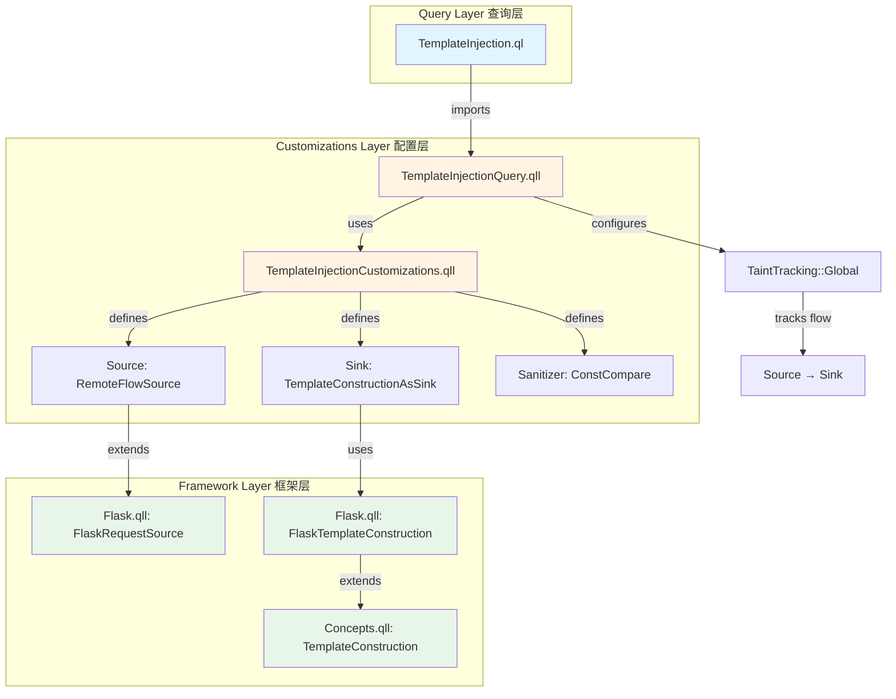
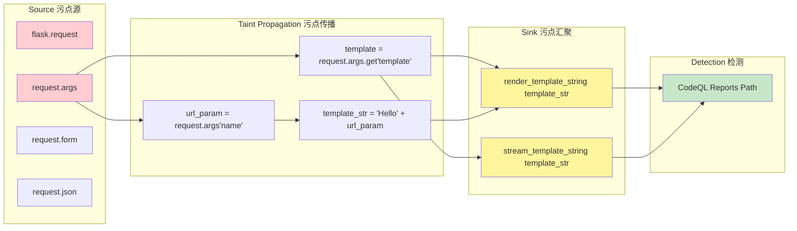
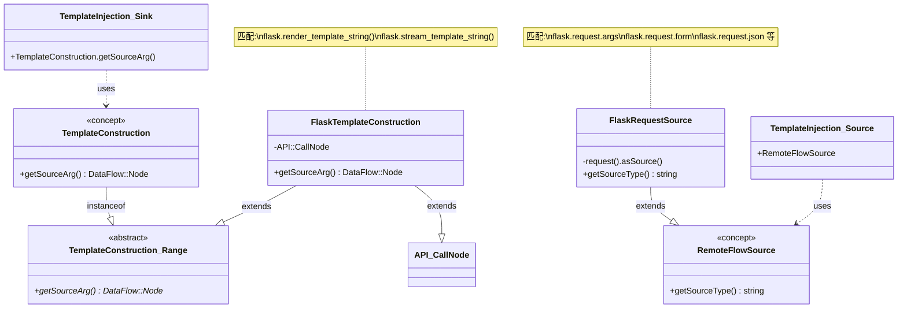
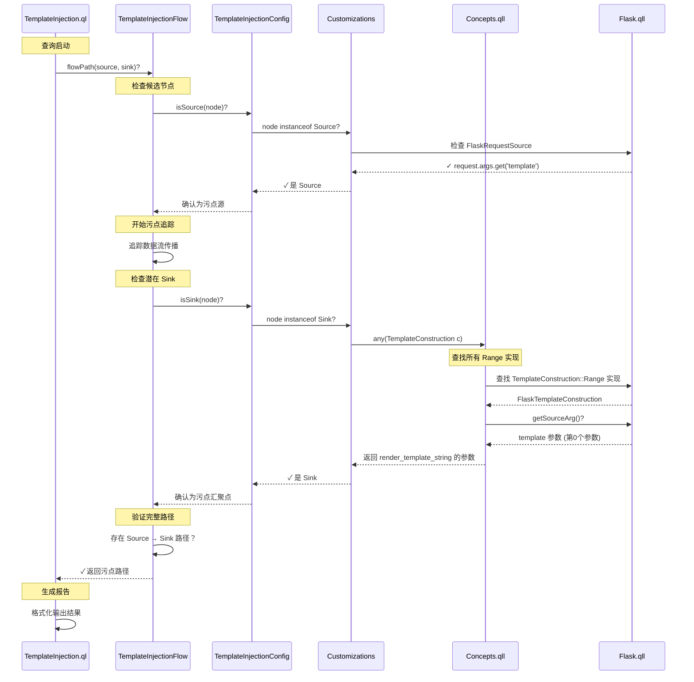

# Flask.qll 代码深度解析

> 本文档详细解析 CodeQL 官方 Flask 框架建模库的实现，帮助读者理解如何为 Python Web 框架编写高质量的 CodeQL 库。

## 目录

1. [概述与导入说明](#1-概述与导入说明)
2. [模块化设计模式](#2-模块化设计模式)
3. [API 图建模技术](#3-api-图建模技术)
4. [核心建模模式详解](#4-核心建模模式详解)
5. [安全相关建模](#5-安全相关建模)
   - 5.1 [Cookie 操作建模](#51-cookie-操作建模)
   - 5.2 [文件系统访问建模](#52-文件系统访问建模)
   - 5.3 [路径注入净化器](#53-路径注入净化器)
   - 5.4 [流摘要（FlowSummary）](#54-流摘要flowsummary)
   - 5.5 [模板注入（SSTI）检测](#55-模板注入ssti检测)
6. [完整代码结构总结](#6-完整代码结构总结)

---

## 1. 概述与导入说明

### 1.1 文件头部文档注释

每个 `.qll` 文件都应该以标准的文档注释开头，说明模块的用途：

```ql
/**
 * Provides classes modeling security-relevant aspects of the `flask` PyPI package.
 * See https://flask.palletsprojects.com/en/1.1.x/.
 */
```

**要点**：
- 使用 `/** ... */` 格式的文档注释
- 说明建模的目标库和版本
- 提供官方文档链接作为参考

### 1.2 关键导入

Flask.qll 的导入部分展示了构建框架库所需的核心依赖：

```ql
private import python
private import semmle.python.dataflow.new.DataFlow
private import semmle.python.dataflow.new.RemoteFlowSources
private import semmle.python.dataflow.new.TaintTracking
private import semmle.python.Concepts
private import semmle.python.frameworks.Werkzeug
private import semmle.python.frameworks.Stdlib
private import semmle.python.ApiGraphs
private import semmle.python.frameworks.internal.InstanceTaintStepsHelper
private import semmle.python.security.dataflow.PathInjectionCustomizations
private import semmle.python.dataflow.new.FlowSummary
private import semmle.python.frameworks.data.ModelsAsData
```

**导入说明**：

| 导入模块 | 用途 |
|----------|------|
| `python` | Python 语言的基础 AST 类型 |
| `DataFlow` | 数据流分析基础设施 |
| `RemoteFlowSources` | 远程流源定义（用户输入） |
| `TaintTracking` | 污点追踪分析 |
| `Concepts` | 安全概念抽象（如文件访问、命令执行） |
| `ApiGraphs` | API 图建模核心库 |
| `InstanceTaintStepsHelper` | 污点步骤辅助类 |
| `FlowSummary` | 流摘要定义 |
| `ModelsAsData` | 数据驱动的模型扩展 |

**注意**：使用 `private import` 可以避免将导入的符号暴露给库的使用者。

---

## 2. 框架库的通用性设计

### 2.1 核心理念：一个库，多种查询

**关键认识**：Flask.qll 不是为某一个特定查询（如 SSTI）设计的，而是一个**通用框架库**，需要支持多种不同的安全查询。

### 2.2 建模分类与用途

Flask.qll 中的建模可以分为以下几类：

| 建模类型 | 示例 | 支持的查询/用途 | CWE 编号 |
|---------|------|----------------|----------|
| **污点源（Source）** | `FlaskRequestSource` | 所有污点追踪查询的入口点 | - |
| **污点传播（Taint Steps）** | `InstanceTaintSteps` | 定义数据如何在对象内传播 | - |
| **重定向响应** | `FlaskRedirectCall` | [开放重定向检测](https://github.com/github/codeql/blob/main/python/ql/src/Security/CWE-601/UrlRedirect.ql) | [CWE-601](https://cwe.mitre.org/data/definitions/601.html) |
| **模板构造** | `FlaskTemplateConstruction` | [服务端模板注入检测](https://codeql.github.com/codeql-query-help/python/py-template-injection/) | [CWE-074](https://cwe.mitre.org/data/definitions/74.html) |
| **文件系统访问** | `FlaskSendFromDirectoryCall` | [路径遍历检测](https://codeql.github.com/codeql-query-help/python/py-path-injection/) | [CWE-022](https://cwe.mitre.org/data/definitions/22.html) |
| **Cookie 设置** | `FlaskResponseSetCookieCall` | Cookie 安全属性检测 | [CWE-614](https://cwe.mitre.org/data/definitions/614.html) |
| **HTTP 响应** | `Response::InstanceSource` | [XSS 检测](https://codeql.github.com/codeql-query-help/python/py-reflective-xss/)、内容类型检测 | [CWE-079](https://cwe.mitre.org/data/definitions/79.html) |
| **路由处理** | `FlaskRouteSetup` | 识别请求处理器、路由参数 | - |
| **视图类** | `Views::View` | 识别基于类的视图、路由解析 | - |

### 2.3 具体示例：FlaskRedirectCall 的作用

让我们深入分析 `FlaskRedirectCall` 的实际用途：

**建模定义**：

```ql
private class FlaskRedirectCall extends Http::Server::HttpRedirectResponse::Range,
  DataFlow::CallCfgNode {

  FlaskRedirectCall() {
    this = API::moduleImport("flask").getMember("redirect").getACall()
  }

  override DataFlow::Node getRedirectLocation() {
    result in [this.getArg(0), this.getArgByName("location")]
  }
}
```

**用途 1：开放重定向漏洞检测**

[UrlRedirect.ql](https://github.com/github/codeql/blob/main/python/ql/src/Security/CWE-601/UrlRedirect.ql) 查询使用这个建模：

```python
# 漏洞代码示例
from flask import Flask, request, redirect

app = Flask(__name__)

@app.route('/goto')
def goto():
    url = request.args.get('url')
    return redirect(url)  # ❌ 开放重定向漏洞
```

**检测逻辑**：
1. **Source**：`request.args.get('url')` 是用户输入（`FlaskRequestSource` + `InstanceTaintSteps`）
2. **Sink**：`redirect()` 的 `location` 参数（`FlaskRedirectCall.getRedirectLocation()`）
3. **查询**：如果存在 Source → Sink 的污点路径，报告漏洞

**用途 2：支持其他重定向相关检测**

- 检测重定向到外部域名
- 检测重定向循环
- 分析重定向链

### 2.4 视图类建模的价值

**Views 模块**虽然不直接用于漏洞检测，但提供了重要的**结构化信息**：

```ql
module Views {
  module View {
    API::Node subclassRef() {
      result = API::moduleImport("flask")
        .getMember("views")
        .getMember(["View", "MethodView"])
        .getASubclass*()
    }
  }
}
```

**用途**：

1. **识别请求处理器**
   ```python
   from flask.views import MethodView

   class UserAPI(MethodView):
       def get(self, user_id):  # ← Views 模块帮助识别这是请求处理器
           return get_user(user_id)
   ```

2. **路由参数识别**
   - `FlaskRouteSetup` 使用 View 信息识别路由参数 `user_id`
   - 路由参数被标记为用户输入（Source）

3. **数据流分析优化**
   - 了解视图类的结构有助于更准确的数据流追踪
   - 识别视图方法的返回值作为 HTTP 响应

### 2.5 通用设计的优势

**可扩展性**：
- 新增查询无需修改框架库
- 不同查询复用相同的建模

**一致性**：
- 所有查询使用统一的概念（Source、Sink、Response 等）
- 降低学习成本

**维护性**：
- 框架 API 变化时，只需更新一处
- 所有依赖的查询自动受益

**示例：一个建模，多个查询**

```
FlaskRequestSource (污点源建模)
    ↓
支持的查询：
    ├─ SSTI (CWE-074)
    ├─ XSS (CWE-079)
    ├─ SQL 注入 (CWE-089)
    ├─ 命令注入 (CWE-078)
    ├─ 路径遍历 (CWE-022)
    └─ 开放重定向 (CWE-601)
```

### 2.6 总结

**关键要点**：

1. ✅ Flask.qll 是**通用框架库**，不是单一查询的附属品
2. ✅ 每个建模都有明确的用途，支持一个或多个安全查询
3. ✅ 看似"无关"的建模（如 View）提供结构化信息，支持精确分析
4. ✅ 通过抽象概念（Concepts.qll）实现框架无关的查询

**阅读建议**：

当你看到一个建模时，问自己：
- 它继承了哪个 `Concepts` 抽象类？（`HttpRedirectResponse`、`TemplateConstruction` 等）
- 这个抽象类对应哪个安全概念？
- 哪些查询会使用这个概念？

---

## 3. 模块化设计模式

### 2.1 顶层模块结构

Flask.qll 使用嵌套模块来组织代码，顶层是 `Flask` 模块：

```ql
/**
 * Provides models for the `flask` PyPI package.
 * See https://flask.palletsprojects.com/en/1.1.x/.
 */
module Flask {
  // 子模块定义...
}
```

### 2.2 子模块划分

Flask 模块内部按功能划分为多个子模块：

```
Flask
├── Views                    # 视图类建模
│   ├── View                # flask.views.View
│   └── MethodView          # flask.views.MethodView
├── FlaskApp                 # Flask 应用实例
├── Blueprint                # 蓝图建模
├── Response                 # HTTP 响应建模
└── (其他功能性建模)
```

### 2.3 子模块示例：Views

```ql
/** Provides models for flask view classes (defined in the `flask.views` module) */
module Views {
  /**
   * Provides models for the `flask.views.View` class and subclasses.
   *
   * See https://flask.palletsprojects.com/en/1.1.x/views/#basic-principle.
   */
  module View {
    /** Gets a reference to the `flask.views.View` class or any subclass. */
    API::Node subclassRef() {
      result =
        API::moduleImport("flask")
            .getMember("views")
            .getMember(["View", "MethodView"])
            .getASubclass*()
      or
      result = ModelOutput::getATypeNode("flask.View~Subclass").getASubclass*()
      or
      result = ModelOutput::getATypeNode("flask.MethodView~Subclass").getASubclass*()
    }
  }
}
```

**设计要点**：
1. 每个子模块都有文档注释说明其用途
2. 使用 `API::Node` 返回类型便于链式调用
3. 支持多种获取方式（直接导入 + 数据驱动扩展）

---

## 3. API 图建模技术

### 3.1 API::moduleImport() 入口

API 图的起点通常是模块导入：

```ql
API::moduleImport("flask")
```

这会匹配所有形式的 flask 导入：
- `import flask`
- `from flask import ...`

### 3.2 链式调用方法

| 方法 | 用途 | 示例 |
|------|------|------|
| `getMember(name)` | 获取成员（属性/方法） | `.getMember("Flask")` |
| `getReturn()` | 获取返回值 | `.getReturn()` |
| `getASubclass()` | 获取子类 | `.getASubclass*()` |
| `getParameter(n)` | 获取第 n 个参数 | `.getParameter(0)` |
| `getACall()` | 获取调用点 | `.getACall()` |

### 3.3 实际示例：FlaskApp 建模

```ql
module FlaskApp {
  /** Gets a reference to the `flask.Flask` class. */
  API::Node classRef() {
    result = API::moduleImport("flask").getMember("Flask") or
    result = ModelOutput::getATypeNode("flask.Flask~Subclass").getASubclass*()
  }

  /** Gets a reference to an instance of `flask.Flask` (a flask application). */
  API::Node instance() { result = classRef().getReturn() }
}
```

**解释**：
1. `classRef()` 获取 `flask.Flask` 类的引用
2. `instance()` 通过 `getReturn()` 获取类的实例（即 `Flask()` 的返回值）

### 3.4 ModelOutput 扩展机制

`ModelOutput::getATypeNode()` 允许通过 YAML 数据文件扩展模型：

```ql
result = ModelOutput::getATypeNode("flask.Flask~Subclass").getASubclass*()
```

这使得用户可以在不修改 QL 代码的情况下添加新的类型映射。

---

## 4. 核心建模模式详解

### 4.1 类引用建模（classRef 模式）

**目的**：识别对特定类的所有引用

```ql
module Response {
  API::Node classRef() {
    result = API::moduleImport("flask").getMember("Response")
    or
    result = [FlaskApp::classRef(), FlaskApp::instance()].getMember("response_class")
    or
    result = ModelOutput::getATypeNode("flask.Response~Subclass").getASubclass*()
  }
}
```

**模式特点**：
- 处理直接导入 (`from flask import Response`)
- 处理别名访问 (`app.response_class`)
- 支持数据驱动扩展

### 4.2 实例源建模（InstanceSource 模式）

**目的**：识别创建类实例的所有方式

```ql
abstract class InstanceSource extends Http::Server::HttpResponse::Range, DataFlow::Node { }

/** A direct instantiation of `flask.Response`. */
private class ClassInstantiation extends InstanceSource, DataFlow::CallCfgNode {
  ClassInstantiation() { this = classRef().getACall() }

  override DataFlow::Node getBody() {
    result in [this.getArg(0), this.getArgByName("response")]
  }

  override string getMimetypeDefault() { result = "text/html" }
}
```

**关键点**：
1. 继承 `Http::Server::HttpResponse::Range` 将其标记为 HTTP 响应
2. 使用 `getACall()` 匹配类实例化
3. 重写方法提供具体实现细节

### 4.3 远程流源建模（RemoteFlowSource）

**目的**：标记来自用户输入的数据源

```ql
private class FlaskRequestSource extends RemoteFlowSource::Range {
  FlaskRequestSource() { this = request().asSource() }

  override string getSourceType() { result = "flask.request" }
}
```

其中 `request()` 的定义：

```ql
/** Gets a reference to the `flask.request` object. */
API::Node request() {
  result = API::moduleImport(["flask", "flask_restful"]).getMember("request")
  or
  result = sessionInterfaceRequestParam()
}
```

### 4.4 污点传播建模（InstanceTaintSteps）

**目的**：定义数据如何在对象内部传播

```ql
private class InstanceTaintSteps extends InstanceTaintStepsHelper {
  InstanceTaintSteps() { this = "flask.Request" }

  override DataFlow::Node getInstance() { result = request().getAValueReachableFromSource() }

  override string getAttributeName() {
    result in [
        "path", "full_path", "base_url", "url", "method",
        "environ", "cookies", "args", "values", "form",
        "json", "data", "headers", "files"
        // ... 更多属性
      ]
  }

  override string getMethodName() { result in ["get_data", "get_json"] }

  override string getAsyncMethodName() { none() }
}
```

**工作原理**：
- `getInstance()` 返回被污染的实例
- `getAttributeName()` 列出会传播污点的属性
- `getMethodName()` 列出会传播污点的方法

### 4.5 路由处理建模（RouteSetup）

**目的**：识别 URL 路由和请求处理器

```ql
abstract class FlaskRouteSetup extends Http::Server::RouteSetup::Range {
  override Parameter getARoutedParameter() {
    not exists(this.getUrlPattern()) and
    result = this.getARequestHandler().getArgByName(_)
    or
    exists(string name |
      result = this.getARequestHandler().getArgByName(name) and
      exists(string match |
        match = this.getUrlPattern().regexpFind(werkzeug_rule_re(), _, _) and
        name = match.regexpCapture(werkzeug_rule_re(), 4)
      )
    )
  }

  override string getFramework() { result = "Flask" }
}
```

具体实现：

```ql
private class FlaskAppRouteCall extends FlaskRouteSetup, DataFlow::CallCfgNode {
  FlaskAppRouteCall() {
    this = FlaskApp::instance().getMember("route").getACall()
    or
    this = Blueprint::instance().getMember("route").getACall()
  }

  override DataFlow::Node getUrlPatternArg() {
    result in [this.getArg(0), this.getArgByName("rule")]
  }

  override Function getARequestHandler() { 
    result.getADecorator().getAFlowNode() = node 
  }
}
```

**关键特性**：
- 使用正则表达式解析 URL 模式中的参数
- 支持 `@app.route()` 装饰器和 `add_url_rule()` 方法
- 自动识别路由参数作为用户输入

### 4.6 HTTP 响应建模

**目的**：识别 HTTP 响应创建点

```ql
private class FlaskRouteHandlerReturn extends Http::Server::HttpResponse::Range, DataFlow::CfgNode
{
  FlaskRouteHandlerReturn() {
    exists(Function routeHandler |
      routeHandler = any(FlaskRouteSetup rs).getARequestHandler() and
      node = routeHandler.getAReturnValueFlowNode() and
      not this instanceof Flask::Response::InstanceSource
    )
  }

  override DataFlow::Node getBody() { result = this }

  override DataFlow::Node getMimetypeOrContentTypeArg() { none() }

  override string getMimetypeDefault() { result = "text/html" }
}
```

**说明**：Flask 允许直接从路由处理器返回字符串作为响应，这里捕获了这种隐式响应。

---

## 5. 安全相关建模

### 5.1 Cookie 操作建模

```ql
class FlaskResponseSetCookieCall extends Http::Server::SetCookieCall, DataFlow::MethodCallNode {
  FlaskResponseSetCookieCall() { this.calls(Flask::Response::instance(), "set_cookie") }

  override DataFlow::Node getHeaderArg() { none() }

  override DataFlow::Node getNameArg() { 
    result in [this.getArg(0), this.getArgByName("key")] 
  }

  override DataFlow::Node getValueArg() { 
    result in [this.getArg(1), this.getArgByName("value")] 
  }
}
```

### 5.2 文件系统访问建模

```ql
private class FlaskSendFromDirectoryCall extends FileSystemAccess::Range, DataFlow::CallCfgNode {
  FlaskSendFromDirectoryCall() {
    this = API::moduleImport("flask").getMember("send_from_directory").getACall()
  }

  override DataFlow::Node getAPathArgument() {
    result in [
        this.getArg(0), this.getArgByName("directory"),
        this.getArg(1), this.getArgByName("filename")
      ]
  }
}
```

### 5.3 路径注入净化器

**目的**：标记安全的路径处理

```ql
private class FlaskSendFromDirectoryCallFilenameSanitizer extends PathInjection::Sanitizer {
  FlaskSendFromDirectoryCallFilenameSanitizer() {
    this = any(FlaskSendFromDirectoryCall c).getArg(1)
    or
    this = any(FlaskSendFromDirectoryCall c).getArgByName("filename")
  }
}
```

**说明**：`send_from_directory` 的 `filename` 参数被框架限制在指定目录内，因此是安全的。

### 5.4 流摘要（FlowSummary）

**目的**：描述数据如何通过函数传播

```ql
private class RenderTemplateStringSummary extends SummarizedCallable {
  RenderTemplateStringSummary() { this = "flask.render_template_string" }

  override DataFlow::CallCfgNode getACall() {
    result = API::moduleImport("flask").getMember("render_template_string").getACall()
  }

  override predicate propagatesFlow(string input, string output, boolean preservesValue) {
    input = "Argument[0]" and
    output = "ReturnValue" and
    preservesValue = false
  }
}
```

**说明**：模板字符串参数会影响返回值，但不是值保持的传播（模板被渲染了）。

### 5.5 模板注入（SSTI）检测

**目的**：完整展示 CodeQL 如何检测服务端模板注入漏洞，从查询定义到 Flask 框架建模的端到端流程。

#### 5.5.1 SSTI 漏洞背景

**什么是服务端模板注入（SSTI）**

服务端模板注入（Server-Side Template Injection, SSTI）是一种安全漏洞，当应用程序将用户输入直接嵌入模板引擎进行渲染时，攻击者可以注入恶意模板语法，导致：

- **远程代码执行（RCE）**：攻击者可以在服务器上执行任意 Python 代码
- **敏感信息泄露**：读取服务器文件、环境变量等
- **服务拒绝（DoS）**：通过恶意模板消耗服务器资源

**Flask 中的危险函数**

Flask 使用 Jinja2 作为模板引擎，以下函数如果传入用户可控的模板字符串则会产生 SSTI 漏洞：

- `flask.render_template_string(template_source, **context)` - 直接渲染模板字符串
- `flask.stream_template_string(template_source, **context)` - 流式渲染模板字符串

**漏洞示例**

```python
from flask import Flask, request, render_template_string

app = Flask(__name__)

@app.route('/hello')
def hello():
    name = request.args.get('name', 'Guest')
    # BAD: 用户输入直接作为模板字符串
    template = '<h1>Hello ' + name + '!</h1>'
    return render_template_string(template)
```

攻击载荷示例：`?name={{config.items()}}`  可以泄露 Flask 配置信息

**CWE 分类**

SSTI 属于 [CWE-074: Improper Neutralization of Special Elements in Output Used by a Downstream Component ('Injection')](https://cwe.mitre.org/data/definitions/74.html)

#### 5.5.2 CodeQL 检测架构

CodeQL 检测 SSTI 漏洞采用**三层架构**设计：

```
┌─────────────────────────────────────────────────────────────┐
│  Layer 1: Query（查询层）                                    │
│  文件: codeql/python/ql/src/Security/CWE-074/               │
│        TemplateInjection.ql                                 │
│  作用: 定义查询元数据和结果格式                              │
└─────────────────────────────────────────────────────────────┘
                          ↓ imports
┌─────────────────────────────────────────────────────────────┐
│  Layer 2: Customizations（自定义配置层）                     │
│  文件: semmle/python/security/dataflow/                     │
│        TemplateInjectionCustomizations.qll                  │
│        TemplateInjectionQuery.qll                           │
│  作用: 定义 Source/Sink/Sanitizer，配置污点追踪            │
└─────────────────────────────────────────────────────────────┘
                          ↓ uses
┌─────────────────────────────────────────────────────────────┐
│  Layer 3: Framework Modeling（框架建模层）                   │
│  文件: semmle/python/frameworks/Flask.qll                   │
│        semmle/python/Concepts.qll                           │
│  作用: 建模 Flask 的 API 行为，提供 TemplateConstruction   │
└─────────────────────────────────────────────────────────────┘
```

**各层职责**

| 层级 | 文件 | 职责 |
|------|------|------|
| Query | `TemplateInjection.ql` | 执行污点追踪查询，格式化输出结果 |
| Customizations | `TemplateInjectionCustomizations.qll` | 定义 `Source`（用户输入）、`Sink`（模板构造）、`Sanitizer`（净化器） |
| Customizations | `TemplateInjectionQuery.qll` | 配置全局污点追踪模块 `TemplateInjectionFlow` |
| Framework | `Flask.qll` | 实现 `FlaskTemplateConstruction` 类，标识 `render_template_string` 调用 |
| Concepts | `Concepts.qll` | 定义抽象概念 `TemplateConstruction::Range` |

**组件依赖关系链**

```
Concepts.qll (定义抽象概念 TemplateConstruction::Range)
    ↓ 被 Customizations 使用
TemplateInjectionCustomizations.qll (将抽象概念转换为具体的 Sink)
    ↓ 被 Query 配置层使用
TemplateInjectionQuery.qll (配置污点追踪引擎)
    ↓ 被查询层使用
TemplateInjection.ql (执行查询并输出结果)
```

**架构设计优势**：

1. **可扩展性**：新框架（如 Django、Tornado）只需实现 `TemplateConstruction::Range` 接口，无需修改 Customizations 和 Query 层
2. **复用性**：`TemplateConstructionAsSink` 通过多态机制自动识别所有框架的模板构造点
3. **模块化**：每层职责清晰，Concepts 定义"是什么"，Customizations 定义"如何用"，Query 定义"如何查"
4. **维护性**：添加新的模板引擎支持不会影响现有查询逻辑

#### 5.5.3 Flask.qll 中的 SSTI 支持

Flask.qll 提供两方面的 SSTI 检测支持：**模板构造点识别** 和 **数据流摘要**。

**1. 模板构造点识别：FlaskTemplateConstruction 类**

该类标识所有可能产生模板注入的 Flask API 调用点（位于 [Flask.qll:725-735](../codeql/python/ql/lib/semmle/python/frameworks/Flask.qll#L725-L735)）：

```ql
/** A call to `flask.render_template_string` or `flask.stream_template_string` as a template construction sink. */
private class FlaskTemplateConstruction extends TemplateConstruction::Range, API::CallNode {
  FlaskTemplateConstruction() {
    this =
      API::moduleImport("flask")
          .getMember(["render_template_string", "stream_template_string"])
          .getACall()
  }

  override DataFlow::Node getSourceArg() { result = this.getArg(0) }
}
```

**关键设计点**：

1. **继承 `TemplateConstruction::Range`**
   这是 `Concepts.qll` 中定义的抽象概念，所有模板引擎的模板构造点都应该实现这个接口：

   ```ql
   // 来自 Concepts.qll:882-893
   abstract class Range extends DataFlow::Node {
     /** Gets the argument that specifies the template source. */
     abstract DataFlow::Node getSourceArg();
   }
   ```

2. **使用 API 图匹配调用点**
   `API::moduleImport("flask").getMember(...).getACall()` 可以匹配所有形式的调用：
   - `flask.render_template_string(template)`
   - `from flask import render_template_string; render_template_string(template)`
   - `import flask; flask.stream_template_string(template)`

3. **重写 `getSourceArg()` 方法**
   返回 `this.getArg(0)` 指定第一个参数（模板字符串）为敏感输入点

**2. 数据流摘要：RenderTemplateStringSummary 和 StreamTemplateStringSummary**

这两个类描述模板渲染函数的数据流行为（位于 [Flask.qll:673-723](../codeql/python/ql/lib/semmle/python/frameworks/Flask.qll#L673-L723)）：

```ql
private class RenderTemplateStringSummary extends SummarizedCallable {
  RenderTemplateStringSummary() { this = "flask.render_template_string" }

  override DataFlow::CallCfgNode getACall() {
    result = API::moduleImport("flask").getMember("render_template_string").getACall()
  }

  override predicate propagatesFlow(string input, string output, boolean preservesValue) {
    input = "Argument[0]" and
    output = "ReturnValue" and
    preservesValue = false  // 模板被处理，不是原值传播
  }
}
```

**流摘要的作用**：

- **输入**：`Argument[0]` 表示第一个参数（模板字符串）
- **输出**：`ReturnValue` 表示函数返回值（渲染后的 HTML）
- **preservesValue = false**：表示这不是值保持的传播，因为模板会被解析和渲染

这使得 CodeQL 可以追踪从模板字符串到渲染结果的数据流。

#### 5.5.4 Source 定义机制与多重继承类型适配

**关键问题：Source 是如何被定义的？为什么 Flask request 会自动成为模板注入的 Source？**

这个问题涉及到 CodeQL 中一个非常重要的设计模式：**通过多重继承实现类型适配**。

##### Source 的三层定义结构

在 `TemplateInjectionCustomizations.qll` 中，Source 的定义看似简单：

```ql
module TemplateInjection {
  /**
   * A data flow source for "template injection" vulnerabilities.
   */
  abstract class Source extends DataFlow::Node { }  // ← 扩展点

  /**
   * An active threat-model source, considered as a flow source.
   */
  private class ActiveThreatModelSourceAsSource extends Source, ActiveThreatModelSource { }
}
```

但实际上包含三个层次：

1. **抽象层** - `Source`: 提供扩展点，供用户自定义
2. **适配层** - `ActiveThreatModelSourceAsSource`: 通过多重继承连接威胁模型和模板注入检测
3. **实现层** - `FlaskRequestSource`: 具体框架的实现

##### 通过多重继承实现类型适配

`ActiveThreatModelSourceAsSource` 是理解整个机制的关键：

```ql
private class ActiveThreatModelSourceAsSource extends Source, ActiveThreatModelSource {
                                                      ^^^^^^  ^^^^^^^^^^^^^^^^^^^^^^
                                                      左边    右边
}
```

**这个类同时继承了两个父类**，实现**类型适配**：

```
威胁模型体系              模板注入体系
     │                       │
     │                       │
ActiveThreatModelSource   Source (抽象)
     │                       │
     └───────┬───────────────┘
             │
             ▼
  ActiveThreatModelSourceAsSource
  (多重继承：同时满足两个父类)
```

**多重继承语义**：
- `extends Source` - 成为 `Source` 类型体系的一部分
- `extends ActiveThreatModelSource` - 约束实例必须是活跃的威胁模型源
- 无构造器 - 不添加额外约束，实例集合 = 满足两个父类的节点集合

**类型适配效果**（基于 CodeQL 的类型交集语义）：

1. **类定义的语义**：
   ```ql
   private class ActiveThreatModelSourceAsSource extends Source, ActiveThreatModelSource { }
   ```
   这个类没有构造器，意味着：**this 满足 ActiveThreatModelSourceAsSource ⟺ (this 满足 Source) ∧ (this 满足 ActiveThreatModelSource)**

2. **类型交集**：
   - 该类的实例集合 = `Source` 的实例集合 ∩ `ActiveThreatModelSource` 的实例集合
   - 由于 `Source` 是抽象类（无独立实例），它的实例集合由其所有子类的并集构成

3. **实例集合确定**：
   - 因为无额外约束，所有满足 `ActiveThreatModelSource` 的节点都满足 `ActiveThreatModelSourceAsSource` 的定义
   - 也就是说：`ActiveThreatModelSourceAsSource` 的实例集合 = `ActiveThreatModelSource` 的实例集合

4. **类型体系连接**：
   - 通过 `extends Source`，`ActiveThreatModelSourceAsSource` 成为 `Source` 类型体系的一个子类
   - 当查询使用 `node instanceof Source` 时，会匹配到所有 `Source` 子类的实例
   - 因此所有 `ActiveThreatModelSource` 的实例都会被匹配到

5. **最终效果**：威胁模型体系中的 `ActiveThreatModelSource` 节点被纳入模板注入检测的 `Source` 体系中

##### 完整的类型继承链

让我们追踪 `request.args.get('tpl')` 如何成为模板注入的 Source：

```
request.args.get('tpl') 这个节点
    ↓ (位于 Flask.qll:438-442)
1️⃣  是 FlaskRequestSource 的实例
    ↓ FlaskRequestSource extends RemoteFlowSource::Range
2️⃣  是 RemoteFlowSource 的实例（继承）
    ↓ RemoteFlowSource extends ThreatModelSource (getThreatModel() = "remote")
3️⃣  是 ThreatModelSource 的实例（继承）
    ↓ 当 "remote" 威胁模型启用时 (Concepts.qll:67-74)
4️⃣  是 ActiveThreatModelSource 的实例（满足威胁模型条件）
    ↓ ActiveThreatModelSourceAsSource extends Source, ActiveThreatModelSource
    ↓ 由于该类无构造器，所有 ActiveThreatModelSource 实例都满足其定义
5️⃣  是 ActiveThreatModelSourceAsSource 的实例（多重继承，类型交集）
    ↓ ActiveThreatModelSourceAsSource extends Source
6️⃣  是 Source 的实例 ✅（通过多重继承传导）
    ↓ (在 TemplateInjectionQuery.qll:15)
7️⃣  被 node instanceof Source 匹配到！
```

**关键步骤解析**：

1. **Flask.qll** 定义 `FlaskRequestSource` 为 `RemoteFlowSource::Range`
   ```ql
   private class FlaskRequestSource extends RemoteFlowSource::Range {
     FlaskRequestSource() { this = request().asSource() }
     override string getSourceType() { result = "flask.request" }
   }
   ```

2. **RemoteFlowSources.qll** 定义 `RemoteFlowSource` 为 `ThreatModelSource`
   ```ql
   class RemoteFlowSource extends ThreatModelSource instanceof RemoteFlowSource::Range { }

   abstract class Range extends ThreatModelSource::Range {
     override string getThreatModel() { result = "remote" }
   }
   ```

3. **Concepts.qll** 定义 `ActiveThreatModelSource`（启用的威胁模型源）
   ```ql
   class ActiveThreatModelSource extends ThreatModelSource {
     ActiveThreatModelSource() {
       exists(string kind |
         currentThreatModel(kind) and  // 检查威胁模型是否启用
         this.getThreatModel() = kind
       )
     }
   }
   ```

4. **TemplateInjectionCustomizations.qll** 通过多重继承类型适配器连接
   ```ql
   private class ActiveThreatModelSourceAsSource extends Source, ActiveThreatModelSource { }
   ```

5. **TemplateInjectionQuery.qll** 使用抽象类检查
   ```ql
   predicate isSource(DataFlow::Node node) {
     node instanceof Source  // ← 匹配所有 Source 的子类
   }
   ```

##### instanceof 的工作原理

**关键误区**：`instanceof` 不是名字匹配，而是**类型继承关系检查**！

```ql
node instanceof Source  // 匹配所有满足以下条件的节点：
                        // 1. node 是 Source 的直接实例
                        // 2. node 是 Source 任何子类的实例
```

**类比 Python 的 isinstance**：

```python
class Animal:
    pass

class Dog(Animal):  # Dog 继承 Animal
    pass

d = Dog()
isinstance(d, Animal)  # True!  即使 d 是 Dog，但它也是 Animal
isinstance(d, Dog)     # True!
```

**CodeQL 中的机制相同**：

```ql
// Flask request 节点验证过程
node instanceof FlaskRequestSource              // ✅ true （直接定义）
node instanceof RemoteFlowSource                // ✅ true （FlaskRequestSource 继承 RemoteFlowSource::Range）
node instanceof ThreatModelSource               // ✅ true （RemoteFlowSource 继承 ThreatModelSource）
node instanceof ActiveThreatModelSource         // ✅ true （威胁模型启用条件满足）
node instanceof ActiveThreatModelSourceAsSource // ✅ true （多重继承，无额外约束）
node instanceof Source                          // ✅ true （通过多重继承传导）

// 所以 isSource(node) 返回 true！
```

##### 为什么使用多重继承实现类型适配？

**问题**：为什么不直接这样写？

```ql
// ❌ 假设的简单设计
predicate isSource(DataFlow::Node node) {
  node instanceof ActiveThreatModelSource  // 直接用威胁模型
}
```

**答案**：失去可扩展性！

**正确设计的优势**：

| 优势 | 说明 | 受益者 |
|------|------|--------|
| **开放封闭原则** | 对扩展开放，对修改封闭 | 所有用户 |
| **用户可扩展** | 用户可以添加自定义 Source | 自定义检测需求 |
| **框架无关** | 不同框架各自定义，互不干扰 | 框架开发者 |
| **默认值提供** | 威胁模型源自动包含 | 大部分场景 |
| **关注点分离** | 威胁模型 vs 漏洞检测 | 维护性 |

##### 用户如何扩展 Source

**场景 1：添加数据库模板源**

假设你发现项目中从数据库读取模板：

```python
template = get_template_from_database()  # 数据库中的模板可能被污染
render_template_string(template)
```

你可以添加自定义 Source：

```ql
class DatabaseTemplateAsSource extends TemplateInjection::Source {
  DatabaseTemplateAsSource() {
    exists(DataFlow::CallCfgNode call |
      call.getFunction().getName() = "get_template_from_database" and
      this = call
    )
  }
}
```

**自动生效！** 因为查询使用 `node instanceof Source`，你的新类也是 `Source` 的子类。

**场景 2：添加配置文件源**

```ql
class ConfigFileTemplateAsSource extends TemplateInjection::Source {
  ConfigFileTemplateAsSource() {
    // 从配置文件读取的模板字符串
    exists(DataFlow::CallCfgNode call |
      call.getFunction().getName() = "read_template_from_config" and
      this = call
    )
  }
}
```

##### 设计模式可视化

**图 1：多重继承类型适配结构**

```
                     DataFlow::Node
                           ↑
         ┌─────────────────┼─────────────────┐
         │                                   │
    ThreatModelSource                     Source (抽象)
         ↑                                   ↑
         │ getThreatModel()                 │ (扩展点)
         │                                   │
 ActiveThreatModelSource                    │
         ↑                                   │
         │                                   │
         └─────────┬─────────────────────────┘
                   │
    ActiveThreatModelSourceAsSource (类型适配器)
                   ↑
                   │
         "remote" 威胁模型启用时
                   ↑
                   │
          RemoteFlowSource
                   ↑
                   │
          FlaskRequestSource
                   ↑
                   │
         request.args.get('tpl')
```

**图 2：数据流向**

```
┌─────────────────────────────────────────┐
│  用户代码: request.args.get('tpl')      │
└─────────────────┬───────────────────────┘
                  │
                  ▼
┌─────────────────────────────────────────┐
│  Framework Layer: FlaskRequestSource    │
│  - 标记为 RemoteFlowSource::Range       │
└─────────────────┬───────────────────────┘
                  │
                  ▼
┌─────────────────────────────────────────┐
│  Concepts Layer: ThreatModelSource      │
│  - getThreatModel() = "remote"          │
└─────────────────┬───────────────────────┘
                  │
                  ▼
┌─────────────────────────────────────────┐
│  Concepts Layer: ActiveThreatModelSource│
│  - 检查 "remote" 是否启用                │
└─────────────────┬───────────────────────┘
                  │
                  ▼
┌─────────────────────────────────────────┐
│  Customizations: ActiveThreatModel...   │
│  - 多重继承类型适配                      │
│  - extends Source + ActiveThreatModel   │
└─────────────────┬───────────────────────┘
                  │
                  ▼
┌─────────────────────────────────────────┐
│  Query Layer: instanceof Source         │
│  - ✅ 匹配成功                           │
└─────────────────────────────────────────┘
```

##### 为什么 ActiveThreatModelSourceAsSource 是 private？

你可能注意到这个类是 `private`：

```ql
private class ActiveThreatModelSourceAsSource extends Source, ActiveThreatModelSource { }
```

**原因**：

1. **隐藏实现细节** - 用户不需要知道这个适配器类的存在
2. **防止误用** - 避免用户错误地继承这个内部实现
3. **允许重构** - CodeQL 团队可以随时改变适配器实现，不影响外部代码
4. **不影响 instanceof** - `private` 限制的是名字可见性，不影响类型关系

**用户应该做的**：
- ✅ `extends Source` - 依赖抽象接口
- ❌ `extends ActiveThreatModelSourceAsSource` - 不应依赖内部实现

##### 总结

**Source 定义机制的核心要点**：

1. **抽象扩展点**：`abstract class Source` 提供用户扩展接口
2. **多重继承类型适配**：`ActiveThreatModelSourceAsSource` 通过多重继承将威胁模型源纳入漏洞检测体系
3. **instanceof 多态**：查询通过 `instanceof Source` 自动匹配所有子类
4. **类型传递性**：Flask request → RemoteFlowSource → ActiveThreatModelSource → Source
5. **开放封闭**：用户可以添加新 Source，无需修改查询代码

**这个设计模式在 CodeQL 中无处不在**：SQL 注入、XSS、命令注入等所有安全查询都使用相同的架构！

#### 5.5.5 声明式调用机制详解

**关键问题：FlaskTemplateConstruction 为什么会被"调用"？**

这是理解 CodeQL 工作机制的核心问题。实际上，CodeQL **不是命令式调用**，而是**声明式匹配**。

##### 完整调用链追踪

**1. 查询入口触发 Sink 查找**

```ql
// TemplateInjection.ql
from TemplateInjectionFlow::PathNode source, TemplateInjectionFlow::PathNode sink
where TemplateInjectionFlow::flowPath(source, sink)
```

查询启动时会使用污点跟踪配置。

**2. 配置层定义 Sink**

```ql
// TemplateInjectionQuery.qll:16
predicate isSink(DataFlow::Node node) {
  node instanceof Sink  // ← 查找所有 Sink 类型的实例
}
```

这里的关键是 `instanceof` 操作符会触发类型匹配。

**3. 定制化层定义 Sink**

```ql
// TemplateInjectionCustomizations.qll:42-44
class TemplateConstructionAsSink extends Sink {
  TemplateConstructionAsSink() {
    this = any(TemplateConstruction c).getSourceArg()  // ← 关键！
  }
}
```

`any(TemplateConstruction c)` 会收集**所有** `TemplateConstruction` 类型的实例。

**4. 概念层定义 TemplateConstruction**

```ql
// Concepts.qll:876
class TemplateConstruction extends DataFlow::Node
  instanceof TemplateConstruction::Range {  // ← 关键！

  DataFlow::Node getSourceArg() { result = super.getSourceArg() }
}
```

`instanceof TemplateConstruction::Range` 的含义：
- **所有继承 `TemplateConstruction::Range` 的类的实例**都是 `TemplateConstruction`
- 这是 CodeQL 的"开放类"机制（open class mechanism）

**5. Flask 实现层**

```ql
// Flask.qll:726
private class FlaskTemplateConstruction extends TemplateConstruction::Range, API::CallNode {
  FlaskTemplateConstruction() {
    this = API::moduleImport("flask")
        .getMember(["render_template_string", "stream_template_string"])
        .getACall()
  }

  override DataFlow::Node getSourceArg() {
    result = this.getArg(0)
  }
}
```

##### 声明式 vs 命令式思维对比

**❌ 命令式思维（不正确）**

```
查询 → 调用 isSink() → 调用 TemplateConstructionAsSink
  → 调用 TemplateConstruction → 调用 FlaskTemplateConstruction
```

**✅ 声明式思维（正确）**

```
查询 → 收集所有满足条件的实例

收集过程：
1. 找所有 Sink 的实例
2. 其中包括 TemplateConstructionAsSink 的实例
3. TemplateConstructionAsSink 需要 TemplateConstruction 实例
4. TemplateConstruction 包括所有 Range 的实例
5. FlaskTemplateConstruction 是 Range 的子类
6. 因此代码中的 render_template_string 调用被收集
```

##### 具体执行过程示例

假设代码：
```python
from flask import render_template_string
result = render_template_string(user_input)  # ← 这一行
```

**CodeQL 执行过程：**

**阶段 1：实例化（评估所有构造器）**

```ql
FlaskTemplateConstruction() {
  this = API::moduleImport("flask")
      .getMember(["render_template_string"])
      .getACall()
}
```

- 在数据库中查找所有 `flask.render_template_string` 的调用
- 找到 `render_template_string(user_input)` 这个调用节点
- 创建一个 `FlaskTemplateConstruction` 实例代表这个调用

**阶段 2：类型层次关联**

```
FlaskTemplateConstruction 实例
  ↓ extends
TemplateConstruction::Range
  ↓ instanceof (类型关系)
TemplateConstruction
  ↓ 调用 getSourceArg()
返回第 0 个参数节点 (user_input)
```

**阶段 3：Sink 收集**

```ql
class TemplateConstructionAsSink extends Sink {
  TemplateConstructionAsSink() {
    this = any(TemplateConstruction c).getSourceArg()
    //    ↑ 收集所有 TemplateConstruction 实例
    //    包括我们的 FlaskTemplateConstruction 实例
  }
}
```

- `user_input` 参数节点被标记为 Sink

**阶段 4：污点跟踪**

```ql
where TemplateInjectionFlow::flowPath(source, sink)
```

- 如果存在从 source 到 `user_input` 的污点流
- 报告漏洞

##### 类型层次可视化

```
                     DataFlow::Node
                           ↑
                           |
              ┌────────────┴────────────┐
              |                         |
         Sink (抽象)         TemplateConstruction
              ↑              (instanceof Range)
              |                         ↑
TemplateConstructionAsSink              |
     (this = any(TC).getSourceArg())    |
              ↑                          |
              |                          |
              └──────────┬───────────────┘
                         |
              TemplateConstruction::Range (抽象)
                         ↑
                         |
             FlaskTemplateConstruction
           (render_template_string 调用)
```

##### 关键机制解析

**1. instanceof 的魔力**

```ql
class TemplateConstruction extends DataFlow::Node
  instanceof TemplateConstruction::Range
```

这意味着：任何 `TemplateConstruction::Range` 的子类实例**自动成为** `TemplateConstruction` 的实例。这是一种**类型聚合机制**。

**2. any() 的作用**

```ql
this = any(TemplateConstruction c).getSourceArg()
```

`any()` 遍历数据库中所有满足类型的实例，等价于：

```ql
exists(TemplateConstruction c | this = c.getSourceArg())
```

**3. 扩展点模式（Extension Point Pattern）**

```
抽象层定义接口 → 具体层实现 → 查询自动收集所有实现
```

这种设计使得：
- 添加新框架支持（如 Django、Tornado）时，只需实现 `TemplateConstruction::Range`
- 无需修改查询层或配置层的代码
- 所有实现会自动被识别为 Sink

##### 调试技巧

如果你想查看 CodeQL 实际找到了什么实例，可以写这样的查询：

```ql
import python
import semmle.python.Concepts

from TemplateConstruction tc
select tc, tc.getSourceArg()
```

这会列出所有被识别为模板构造的调用及其源参数。

##### 总结

`FlaskTemplateConstruction` 不是被"调用"的，而是：

1. **声明**了一个模式："Flask 的 render_template_string 调用是模板构造"
2. CodeQL **自动匹配**代码中所有符合这个模式的地方
3. 通过**类型层次**，这些实例自动成为 `TemplateConstruction` 和 `Sink`
4. 污点跟踪引擎使用这些 Sink 进行分析

**这是 CodeQL 强大的地方**：你只需声明"什么是漏洞模式"，引擎会自动找到所有匹配项，无需编写命令式的搜索逻辑。

#### 5.5.6 检测流程串联

完整的 SSTI 检测流程如下：

**1. Source（污点源）- 用户输入**

来自 Flask 请求对象的所有用户可控数据（[Flask.qll:438-442](../codeql/python/ql/lib/semmle/python/frameworks/Flask.qll#L438-L442)）：

```ql
private class FlaskRequestSource extends RemoteFlowSource::Range {
  FlaskRequestSource() { this = request().asSource() }

  override string getSourceType() { result = "flask.request" }
}
```

**关键问题**：为什么只定义了 `request()` 对象，却能自动识别所有属性（args、form、json 等）？

**答案**：通过 **InstanceTaintSteps** 机制实现污点传播（[Flask.qll:444-464](../codeql/python/ql/lib/semmle/python/frameworks/Flask.qll#L444-L464)）：

```ql
private class InstanceTaintSteps extends InstanceTaintStepsHelper {
  InstanceTaintSteps() { this = "flask.Request" }

  override DataFlow::Node getInstance() {
    result = request().getAValueReachableFromSource()
  }

  override string getAttributeName() {
    result in [
      "path", "full_path", "base_url", "url", "method",
      "environ", "cookies", "args", "values", "form",
      "json", "data", "headers", "files"
    ]
  }

  override string getMethodName() { result in ["get_data", "get_json"] }
}
```

**工作原理**：
1. **getInstance()** - 返回所有 `request` 对象的实例
2. **getAttributeName()** - 列出会传播污点的属性
3. **污点传播规则**：如果 `request` 被标记为污点源，那么 `request.args`、`request.form` 等所有列出的属性也会被自动标记为污点

**用户输入来源**（通过污点传播自动识别）：
- `request.args` - URL 查询参数
- `request.form` - POST 表单数据
- `request.json` - JSON 请求体
- `request.cookies` - Cookie
- `request.headers` - HTTP 头
- `request.data` - 原始请求数据

**2. Sink（污点汇聚点）- 模板构造**

所有 `FlaskTemplateConstruction` 实例的 `getSourceArg()` 都是 sink（[TemplateInjectionCustomizations.qll:42-44](../codeql/python/ql/lib/semmle/python/security/dataflow/TemplateInjectionCustomizations.qll#L42-L44)）：

```ql
class TemplateConstructionAsSink extends Sink {
  TemplateConstructionAsSink() {
    // 🔑 关键：这里使用了 Concepts.qll 中定义的抽象类
    // any(TemplateConstruction c) 会匹配所有实现了 TemplateConstruction::Range 的类
    // 包括 Flask.qll 中的 FlaskTemplateConstruction
    this = any(TemplateConstruction c).getSourceArg()
  }
}
```

**多态机制解析**：

1. **抽象概念查询**：`any(TemplateConstruction c)` 查找所有 `TemplateConstruction` 实例
2. **自动框架匹配**：因为 `FlaskTemplateConstruction` 继承了 `TemplateConstruction::Range`，它会被自动包含
3. **扩展性保证**：当添加 Django、Tornado 等框架的模板构造类时，只要它们也继承 `TemplateConstruction::Range`，就会自动被识别为 Sink
4. **零配置复用**：Customizations 层无需修改即可支持新框架

**3. Taint Tracking（污点追踪配置）**

`TemplateInjectionQuery.qll` 定义全局污点追踪模块（[TemplateInjectionQuery.qll:14-25](../codeql/python/ql/lib/semmle/python/security/dataflow/TemplateInjectionQuery.qll#L14-L25)）：

```ql
private module TemplateInjectionConfig implements DataFlow::ConfigSig {
  predicate isSource(DataFlow::Node node) { node instanceof Source }
  predicate isSink(DataFlow::Node node) { node instanceof Sink }
  predicate isBarrierIn(DataFlow::Node node) { node instanceof Sanitizer }
}

module TemplateInjectionFlow = TaintTracking::Global<TemplateInjectionConfig>;
```

**4. Query（查询执行）**

`TemplateInjection.ql` 执行污点追踪并输出结果（[TemplateInjection.ql:17-20](../codeql/python/ql/src/Security/CWE-074/TemplateInjection.ql#L17-L20)）：

```ql
from TemplateInjectionFlow::PathNode source, TemplateInjectionFlow::PathNode sink
where TemplateInjectionFlow::flowPath(source, sink)
select sink.getNode(), source, sink,
  "This template construction depends on a $@.",
  source.getNode(), "user-provided value"
```

**数据流传播过程**

```
用户输入 (Source)
    ↓
request.args.get('template')   ← FlaskRequestSource 识别
    ↓
[污点传播步骤]
    ↓ 赋值、拼接、参数传递...
    ↓
render_template_string(user_input)   ← FlaskTemplateConstruction.getSourceArg() 识别为 Sink
    ↓
[CodeQL 报告路径]
```

#### 5.5.7 完整检测流程图

**图 1：三层架构交互图**



**图 2：污点追踪数据流图**



**图 3：类关系图**



**图 4：运行时交互序列图**

这个图展示查询执行时各组件如何协作：



**序列图说明**：

1. **查询启动阶段**：`TemplateInjection.ql` 调用 `TemplateInjectionFlow::flowPath()` 开始污点追踪
2. **Source 识别**：
   - Flow 引擎询问 Config："这个节点是 Source 吗？"
   - Config 委托给 Customizations 层的 `Source` 类
   - Customizations 通过 Flask.qll 的 `FlaskRequestSource` 识别用户输入
3. **污点传播**：Flow 引擎追踪数据流在程序中的传播路径
4. **Sink 识别**（关键的多态机制）：
   - Flow 引擎询问 Config："这个节点是 Sink 吗？"
   - Config 委托给 Customizations 的 `TemplateConstructionAsSink`
   - Customizations 查询 Concepts.qll 的抽象概念 `TemplateConstruction`
   - Concepts 通过多态查找所有实现了 `Range` 的类（包括 Flask.qll 的实现）
   - Flask.qll 返回 `FlaskTemplateConstruction.getSourceArg()`
5. **路径验证**：Flow 引擎确认存在完整的 Source → Sink 路径
6. **结果输出**：Query 格式化并输出警报信息

这个序列展示了**面向对象设计**和**多态机制**如何让系统具有高度的可扩展性。

#### 5.5.8 代码示例与检测演示

**漏洞代码示例**

```python
from flask import Flask, request, render_template_string

app = Flask(__name__)

# 场景 1：直接拼接用户输入到模板
@app.route('/greet1')
def greet1():
    name = request.args.get('name', 'World')
    template = f'<h1>Hello {name}!</h1>'  # 用户输入嵌入模板
    return render_template_string(template)  # BAD: SSTI 漏洞

# 场景 2：用户输入直接作为模板字符串
@app.route('/greet2')
def greet2():
    template = request.args.get('template', '<h1>Default</h1>')
    return render_template_string(template)  # BAD: SSTI 漏洞

# 场景 3：表单数据作为模板
@app.route('/render', methods=['POST'])
def render():
    template = request.form.get('content')
    return render_template_string(template)  # BAD: SSTI 漏洞

# 场景 4：JSON 数据作为模板
@app.route('/api/render', methods=['POST'])
def api_render():
    data = request.get_json()
    template = data.get('template')
    return render_template_string(template)  # BAD: SSTI 漏洞
```

**CodeQL 检测结果**

运行 `TemplateInjection.ql` 查询会产生以下结果：

| Location | Message |
|----------|---------|
| `app.py:8` | This template construction depends on a user-provided value (from `request.args.get('name')` at line 7) |
| `app.py:14` | This template construction depends on a user-provided value (from `request.args.get('template')` at line 13) |
| `app.py:19` | This template construction depends on a user-provided value (from `request.form.get('content')` at line 18) |
| `app.py:25` | This template construction depends on a user-provided value (from `request.get_json()` at line 23) |

**检测步骤详解**

以场景 1 为例，CodeQL 的检测过程：

1. **识别 Source**
   `FlaskRequestSource` 识别 `request.args.get('name')` 为用户输入源

2. **污点传播**
   CodeQL 追踪污点流动：
   ```
   request.args.get('name') → name 变量 → f-string 拼接 → template 变量
   ```

3. **识别 Sink**
   `FlaskTemplateConstruction` 识别 `render_template_string(template)` 调用，
   且 `getSourceArg()` 返回第一个参数 `template`

4. **验证路径**
   `TemplateInjectionFlow::flowPath(source, sink)` 确认存在从 source 到 sink 的污点路径

5. **生成报告**
   输出包含源位置、汇聚位置和完整路径的警报

**修复建议**

安全的做法是使用参数化模板：

```python
# 安全方式 1：使用模板参数
@app.route('/greet_safe1')
def greet_safe1():
    name = request.args.get('name', 'World')
    # GOOD: 用户输入作为参数，不是模板本身
    return render_template_string('<h1>Hello {{ name }}!</h1>', name=name)

# 安全方式 2：使用模板文件
@app.route('/greet_safe2')
def greet_safe2():
    name = request.args.get('name', 'World')
    # GOOD: 使用预定义模板文件
    return render_template('greet.html', name=name)
```

---

## 6. 完整代码结构总结

### 6.1 模块层次结构

```
Flask (module)
│
├── Views (module)
│   ├── View (module)
│   │   └── subclassRef() : API::Node
│   └── MethodView (module)
│       └── subclassRef() : API::Node
│
├── FlaskApp (module)
│   ├── classRef() : API::Node
│   └── instance() : API::Node
│
├── Blueprint (module)
│   ├── classRef() : API::Node
│   └── instance() : API::Node
│
├── Response (module)
│   ├── classRef() : API::Node
│   ├── InstanceSource (abstract class)
│   ├── ClassInstantiation (class)
│   ├── FlaskMakeResponseCall (class)
│   ├── FlaskJsonifyCall (class)
│   └── instance() : DataFlow::Node
│
├── request() : API::Node
│
├── FlaskViewClass (class)
├── FlaskMethodViewClass (class)
├── FlaskRouteSetup (abstract class)
├── FlaskAppRouteCall (class)
├── FlaskAppAddUrlRuleCall (class)
│
├── FlaskRequestSource (class) : RemoteFlowSource
├── InstanceTaintSteps (class)
│
├── FlaskRedirectCall (class)
├── FlaskResponseSetCookieCall (class)
├── FlaskSendFromDirectoryCall (class)
├── FlaskSendFileCall (class)
│
├── FlaskLogger (class)
├── RenderTemplateStringSummary (class)
└── FlaskTemplateConstruction (class)
```

### 6.2 建模清单

| 安全概念 | 实现类 | 用途 |
|----------|--------|------|
| 远程流源 | `FlaskRequestSource` | 识别用户输入 |
| HTTP 响应 | `Response::InstanceSource` | 响应体安全分析 |
| 路由设置 | `FlaskRouteSetup` | URL 路由分析 |
| Cookie 写入 | `FlaskResponseSetCookieCall` | Cookie 安全分析 |
| 文件访问 | `FlaskSendFromDirectoryCall` | 路径遍历分析 |
| 重定向 | `FlaskRedirectCall` | 开放重定向分析 |
| 模板渲染 | `FlaskTemplateConstruction` | 模板注入分析 |

### 6.3 设计原则总结

1. **模块化**：按功能划分子模块，便于维护和理解
2. **可扩展**：使用 `ModelOutput` 支持数据驱动扩展
3. **完整性**：覆盖类引用、实例创建、方法调用等多种访问方式
4. **安全导向**：专注于安全相关的 API 建模
5. **文档化**：每个公共谓词和类都有文档注释

---

## 参考资料

- [Flask 官方文档](https://flask.palletsprojects.com/)
- [CodeQL Types 文档](https://codeql.github.com/docs/ql-language-reference/types/) - 多重继承和类型系统
- [CodeQL API Graphs 文档](https://codeql.github.com/docs/codeql-language-guides/using-api-graphs-in-python/)
- [CodeQL Concepts 文档](https://codeql.github.com/docs/codeql-language-guides/codeql-library-for-python/)
- [Flask.qll 源码](../codeql/python/ql/lib/semmle/python/frameworks/Flask.qll)
- [TemplateInjectionCustomizations.qll 源码](https://github.com/github/codeql/blob/main/python/ql/lib/semmle/python/security/dataflow/TemplateInjectionCustomizations.qll)

