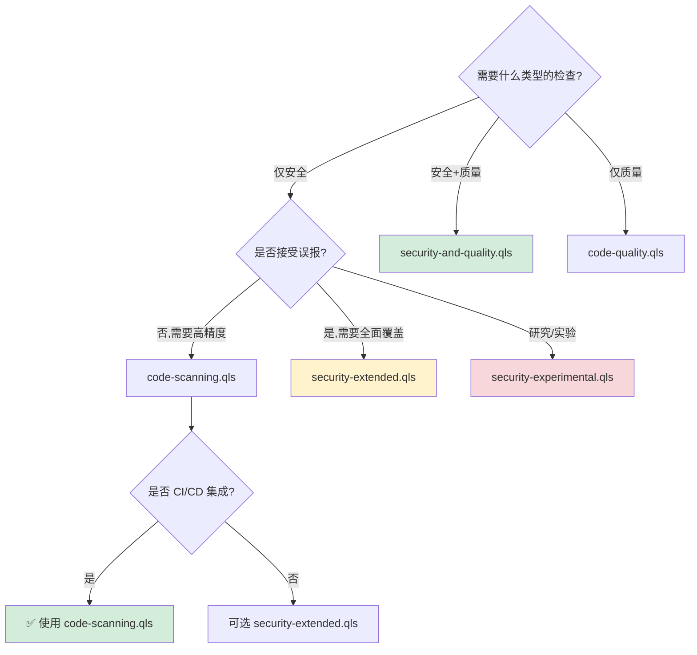

# CodeQL Query Suite 完整指南

> 深入理解 CodeQL 查询套件的概念、架构和最佳实践

## 目录

- [什么是 Query Suite](#什么是-query-suite)
- [使用场景对比](#使用场景对比)
- [.qls 文件格式详解](#qls-文件格式详解)
- [工作流程架构](#工作流程架构)
- [常见查询套件类型](#常见查询套件类型)
- [实际使用示例](#实际使用示例)
- [自定义查询套件](#自定义查询套件)
- [最佳实践](#最佳实践)
- [常见问题 FAQ](#常见问题-faq)

---

## 什么是 Query Suite

### 核心概念

**Query Suite（查询套件）** 是 CodeQL 提供的一种机制，用于将多个相关的查询组织成一个逻辑单元。它通过 `.qls` 文件定义，允许你：

- 📦 **批量执行查询**：一次性运行多个相关查询，而不是逐个执行
- 🎯 **标准化检测**：使用预定义的查询集合，确保一致的代码审查标准
- 🔧 **灵活配置**：根据需求选择、过滤和组合查询
- 🚀 **提升效率**：简化 CI/CD 集成，统一管理安全和质量检查

### 与单个查询的区别

| 维度 | 单个查询 (.ql) | 查询套件 (.qls) |
|------|---------------|----------------|
| **用途** | 检测特定漏洞或模式 | 组织多个相关查询 |
| **执行方式** | `codeql query run` | `codeql database analyze` |
| **适用场景** | 针对性检测、调试、研究 | 全面扫描、CI/CD、标准化检查 |
| **配置复杂度** | 简单，直接指定查询文件 | 灵活，可配置选择规则 |
| **结果输出** | 单个查询结果 | 聚合多个查询结果 |

**示例对比**：

```bash
# 单个查询：检测 SQL 注入
codeql query run codeql/python/ql/src/Security/CWE-089/SqlInjection.ql \
  --database=python-db

# 查询套件：运行所有安全查询（本地路径方式）
codeql database analyze python-db \
  codeql/python/ql/src/codeql-suites/python-security-extended.qls \
  --format=sarif-latest --output=results.sarif

# 查询套件：使用查询包格式（推荐）
codeql database analyze python-db \
  codeql/python-queries:codeql-suites/python-security-extended.qls \
  --format=sarif-latest --output=results.sarif
```

---

## 使用场景对比

### 何时使用单个查询？

✅ **适用场景**：
- **针对性研究**：调查特定类型的漏洞（如 XSS、CSRF）
- **查询开发**：测试和调试新编写的查询
- **快速验证**：确认某个漏洞是否存在
- **学习探索**：理解 CodeQL 查询的工作原理

**示例**：你怀疑代码中存在命令注入漏洞，想快速验证：

```bash
codeql query run codeql/python/ql/src/Security/CWE-078/CommandInjection.ql \
  --database=python-db --format=csv
```

### 何时使用查询套件？

✅ **适用场景**：
- **全面安全扫描**：检测所有已知的安全漏洞
- **代码质量检查**：运行代码风格和最佳实践检查
- **CI/CD 集成**：自动化代码审查流程
- **合规性检查**：确保代码符合安全标准（如 OWASP Top 10）
- **定期审计**：周期性地对代码库进行全面分析

**示例**：在 CI/CD 流水线中进行安全扫描：

```bash
codeql database analyze python-db \
  codeql/python/ql/src/codeql-suites/python-code-scanning.qls \
  --format=sarif-latest --output=results.sarif
```

---

## .qls 文件格式详解

### 基本结构

查询套件文件使用 **YAML** 格式，具有简洁的声明式语法：

```yaml
- description: 查询套件的描述
- queries: 查询文件的路径
- apply: 选择器配置文件
  from: 配置文件来源
- include:
    id:
      - query-id-1
      - query-id-2
- exclude:
    id:
      - query-id-to-exclude
```

### 配置项说明

#### 1. `description` - 套件描述

```yaml
- description: Security-extended queries for Python
```

- **作用**：提供人类可读的套件说明
- **最佳实践**：简洁描述套件的目的和覆盖范围

#### 2. `queries` - 查询路径

```yaml
- queries: .
```

- **作用**：指定查询文件的搜索路径
- **常见值**：
  - `.`：当前目录及子目录
  - `path/to/queries`：特定目录
  - `specific-query.ql`：单个查询文件

#### 3. `apply` - 应用选择器

```yaml
- apply: security-extended-selectors.yml
  from: codeql/suite-helpers
```

- **作用**：引用预定义的查询选择规则
- **from**：选择器配置文件的来源包
- **常见选择器**：
  - `security-extended-selectors.yml`：扩展安全查询
  - `code-scanning-selectors.yml`：代码扫描标准查询
  - `security-and-frozen-quality-selectors.yml`：安全和质量查询

#### 4. `include` - 包含特定查询

```yaml
- include:
    id:
      - py/sql-injection
      - py/command-injection
      - py/code-injection
```

- **作用**：明确包含特定查询
- **使用场景**：
  - 添加自定义查询
  - 在标准套件基础上增加额外检查
  - 创建专项检测套件

#### 5. `exclude` - 排除特定查询

```yaml
- exclude:
    id:
      - py/unused-local-variable  # 排除未使用变量检查
```

- **作用**：从套件中移除特定查询
- **使用场景**：
  - 减少误报
  - 排除不适用的检查
  - 性能优化

### 实际示例解析

#### 示例 1：简单安全套件

```yaml
# python-security-extended.qls
- description: Security-extended queries for Python
- queries: .
- apply: security-extended-selectors.yml
  from: codeql/suite-helpers
```

**解释**：
1. 在当前目录（及子目录）查找所有查询
2. 应用 `security-extended-selectors.yml` 规则筛选查询
3. 自动包含所有标记为"安全-扩展"级别的查询

#### 示例 2：安全+质量套件

```yaml
# python-security-and-quality.qls
- description: Security-and-quality queries for Python
- queries: .
- apply: security-and-frozen-quality-selectors.yml
  from: codeql/suite-helpers
- include:
    id:
      - py/asserts-tuple
      - py/call-to-non-callable
      - py/duplicate-key-dict-literal
      # ... 更多质量检查
```

**解释**：
1. 首先应用安全和质量选择器（基础集）
2. 然后明确包含额外的质量检查
3. 实现安全和代码质量的全面覆盖

---

## 工作流程架构

### 整体流程图


### 执行流程详解

1. **加载阶段**
   - 读取 CodeQL 数据库
   - 解析 .qls 文件的 YAML 配置

2. **查询发现阶段**
   - 根据 `queries` 路径扫描目录
   - 收集所有 `.ql` 文件
   - 读取查询元数据（`@name`, `@kind`, `@tags` 等）

3. **选择器应用阶段**
   - 加载 `apply` 指定的选择器规则
   - 根据查询元数据（如 tags、precision）匹配规则
   - 示例规则：选择所有带有 `security` 标签且 precision 为 `high` 或 `very-high` 的查询

4. **Include/Exclude 处理**
   - **优先级**：`exclude` > `include` > 选择器规则
   - 先应用 `exclude`，移除明确排除的查询
   - 然后应用 `include`，添加明确包含的查询

5. **执行阶段**
   - 并行执行最终查询列表
   - 每个查询独立运行，生成结果

6. **结果聚合阶段**
   - 收集所有查询的结果
   - 按文件位置、严重性等维度组织
   - 生成统一的输出格式（SARIF、CSV 等）

---

## 常见查询套件类型

CodeQL 官方为每种语言提供了标准的查询套件。以下表格对比了最常用的几种套件：

| 套件类型 | 用途 | 覆盖范围 | 适用场景 | 推荐程度 |
|---------|------|---------|---------|---------|
| **`security-extended.qls`**<br/>扩展安全查询 | 全面的安全漏洞检测，包含所有安全相关查询 | • OWASP Top 10 漏洞<br/>• CWE 常见弱点<br/>• 高精度和中等精度的安全查询<br/>• 实验性安全查询（部分） | • 安全审计<br/>• 渗透测试前的代码审查<br/>• 安全关键型应用开发 | ✅ 推荐用于全面安全扫描 |
| **`code-scanning.qls`**<br/>GitHub 代码扫描 | GitHub Advanced Security 使用的标准查询集 | • 高精度安全查询<br/>• 关键代码质量问题<br/>• 适合 CI/CD 自动化的查询（低误报率） | • GitHub Actions 集成<br/>• 自动化安全检查<br/>• Pull Request 审查 | ✅ 推荐用于 CI/CD |
| **`security-and-quality.qls`**<br/>安全+质量 | 同时检测安全漏洞和代码质量问题 | • 所有安全查询<br/>• 代码风格问题<br/>• 潜在的 bug<br/>• 性能问题 | • 全面代码审查<br/>• 项目质量评估<br/>• 技术债务分析 | ✅ 推荐用于综合分析 |
| **`code-quality.qls`**<br/>纯代码质量 | 仅关注代码质量，不包含安全查询 | • 代码异味<br/>• 最佳实践违规<br/>• 可维护性问题<br/>• ❌ 不包含安全漏洞检测 | • 代码重构<br/>• 提升代码可读性<br/>• 团队代码规范检查 | ⚠️ 仅用于质量检查 |
| **`security-experimental.qls`**<br/>实验性安全查询 | 包含实验性和研究阶段的安全查询 | • ⚠️ 新开发的查询（可能有误报）<br/>• ⚠️ 边缘案例检测<br/>• ⚠️ 研究性漏洞模式 | • 安全研究<br/>• 发现未知漏洞模式<br/>• 评估新查询效果 | ⚠️ 不建议用于生产环境 |

### 使用示例

**Python 安全扫描**：

```bash
# 使用查询包格式（推荐）
codeql database analyze python-db \
  codeql/python-queries:codeql-suites/python-security-extended.qls \
  --format=sarif-latest --output=security-results.sarif

# 或使用本地路径
codeql database analyze python-db \
  codeql/python/ql/src/codeql-suites/python-security-extended.qls \
  --format=sarif-latest --output=security-results.sarif
```

**GitHub 代码扫描**：

```bash
codeql database analyze python-db \
  codeql/python-queries:codeql-suites/python-code-scanning.qls \
  --format=sarif-latest --output=code-scanning.sarif

# 上传到 GitHub（需要 GitHub Actions 环境）
# upload-sarif action 会自动处理 code-scanning.sarif
```

### 套件选择决策树



### 套件对比分析

通过 `codeql resolve queries` 命令可以查看每个套件包含的具体查询。以下是 Python 三个主要安全套件的对比：

**查询套件解析命令**：

```bash
# 查看 code-scanning 套件包含的查询
codeql resolve queries \
  codeql/python-queries:codeql-suites/python-code-scanning.qls

# 查看 security-extended 套件包含的查询
codeql resolve queries \
  codeql/python-queries:codeql-suites/python-security-extended.qls

# 查看 security-experimental 套件包含的查询
codeql resolve queries \
  codeql/python-queries:codeql-suites/python-security-experimental.qls

# 输出为 JSON 格式以便分析
codeql resolve queries \
  codeql/python-queries:codeql-suites/python-security-extended.qls \
  --format=json
```

**三大套件对比表**（基于 codeql/python-queries 1.7.0）：

| 对比维度 | code-scanning | security-extended | security-experimental |
|---------|---------------|-------------------|----------------------|
| **查询数量** | 45 个 | 52 个 | 77 个 |
| **安全查询数** | 41 个 | 48 个 | 73 个（含 25 个实验性） |
| **误报率** | 极低（生产就绪） | 低-中等 | 中-高（需验证） |
| **覆盖的 CWE** | 30+ 个核心 CWE<br/>CWE-20, 22, 74, 78, 79, 89, 90, 94, 113, 116, 209, 215, 285, 295, 312, 326, 327, 352, 377, 502, 601, 611, 614, 643, 730, 776, 918, 943, 1004, 1275 | code-scanning 所有 CWE + <br/>CWE-117 (日志注入)<br/>CWE-732 (文件权限)<br/>CWE-918 (Partial SSRF) | security-extended 所有 CWE + <br/>CWE-91, 176, 208, 287, 338, 340, 347, 348, 409, 522, 770, 942, 1236<br/>及多个 CWE 的实验性变体 |
| **典型查询** | • SQL 注入 (CWE-89)<br/>• XSS (CWE-79)<br/>• 命令注入 (CWE-78)<br/>• 路径遍历 (CWE-22)<br/>• SSRF (CWE-918)<br/>• NoSQL 注入 (CWE-943) | code-scanning 所有查询 + <br/>• 日志注入 (CWE-117)<br/>• 弱文件权限 (CWE-732)<br/>• 部分 SSRF (CWE-918)<br/>• Tar Slip 变体 | security-extended 所有查询 + <br/>• 时序攻击 (CWE-208)<br/>• JWT 漏洞 (CWE-347)<br/>• CSV 注入 (CWE-1236)<br/>• CORS 错误配置 (CWE-942)<br/>• 不安全的随机数 (CWE-338) |
| **推荐场景** | ✅ CI/CD 自动化<br/>✅ Pull Request 检查<br/>✅ GitHub Advanced Security | ✅ 安全审计<br/>✅ 发布前全面扫描<br/>✅ 合规性检查 | ⚠️ 安全研究<br/>⚠️ 漏洞挖掘<br/>❌ 不建议用于 CI/CD |

**详细 CWE 覆盖对比**（基于实际查询输出）：

| CWE 编号 | 漏洞类型 | code-scanning | security-extended | security-experimental |
|---------|---------|---------------|-------------------|----------------------|
| **CWE-20** | 输入验证 | ✅ (4) | ✅ (4) | ✅ (4) |
| **CWE-22** | 路径遍历 | ✅ (1) | ✅ (2) | ✅ (5) |
| **CWE-74** | 注入 | ✅ (1) | ✅ (1) | ✅ (2) |
| **CWE-78** | 命令注入 | ✅ (1) | ✅ (2) | ✅ (2) |
| **CWE-79** | XSS | ✅ (1) | ✅ (2) | ✅ (3) |
| **CWE-89** | SQL 注入 | ✅ (1) | ✅ (1) | ✅ (1) |
| **CWE-90** | LDAP 注入 | ✅ (1) | ✅ (1) | ✅ (1) |
| **CWE-91** | XSLT 注入 | ❌ | ❌ | ✅ (1) |
| **CWE-94** | 代码注入 | ✅ (1) | ✅ (1) | ✅ (2) |
| **CWE-113** | HTTP 头注入 | ✅ (1) | ✅ (1) | ✅ (1) |
| **CWE-116** | 编码输出转义 | ✅ (1) | ✅ (1) | ✅ (1) |
| **CWE-117** | 日志注入 | ❌ | ✅ (1) | ✅ (1) |
| **CWE-176** | Unicode 绕过 | ❌ | ❌ | ✅ (1) |
| **CWE-208** | 时序攻击 | ❌ | ❌ | ✅ (4) |
| **CWE-209** | 堆栈跟踪泄露 | ✅ (1) | ✅ (1) | ✅ (1) |
| **CWE-215** | 调试信息泄露 | ✅ (1) | ✅ (1) | ✅ (1) |
| **CWE-285** | 授权问题 | ✅ (1) | ✅ (1) | ✅ (1) |
| **CWE-287** | 认证问题 | ❌ | ❌ | ✅ (2) |
| **CWE-295** | 证书验证 | ✅ (1) | ✅ (2) | ✅ (2) |
| **CWE-312** | 明文存储 | ✅ (2) | ✅ (2) | ✅ (2) |
| **CWE-326** | 弱加密密钥 | ✅ (1) | ✅ (1) | ✅ (1) |
| **CWE-327** | 弱加密算法 | ✅ (4) | ✅ (4) | ✅ (5) |
| **CWE-338** | 不安全随机数 | ❌ | ❌ | ✅ (1) |
| **CWE-340** | UUID 可预测性 | ❌ | ❌ | ✅ (1) |
| **CWE-347** | JWT 验证缺失 | ❌ | ❌ | ✅ (2) |
| **CWE-348** | 使用客户端 IP | ❌ | ❌ | ✅ (1) |
| **CWE-352** | CSRF | ✅ (1) | ✅ (1) | ✅ (1) |
| **CWE-377** | 不安全临时文件 | ✅ (1) | ✅ (1) | ✅ (1) |
| **CWE-409** | 解压炸弹 | ❌ | ❌ | ✅ (1) |
| **CWE-502** | 不安全反序列化 | ✅ (1) | ✅ (1) | ✅ (1) |
| **CWE-522** | LDAP 不安全认证 | ❌ | ❌ | ✅ (1) |
| **CWE-601** | URL 重定向 | ✅ (1) | ✅ (1) | ✅ (1) |
| **CWE-611** | XXE | ✅ (1) | ✅ (1) | ✅ (2) |
| **CWE-614** | 不安全 Cookie | ✅ (1) | ✅ (1) | ✅ (1) |
| **CWE-643** | XPath 注入 | ✅ (1) | ✅ (1) | ✅ (1) |
| **CWE-730** | ReDoS | ✅ (3) | ✅ (3) | ✅ (3) |
| **CWE-732** | 弱文件权限 | ❌ | ✅ (1) | ✅ (1) |
| **CWE-770** | DoS (资源) | ❌ | ❌ | ✅ (1) |
| **CWE-776** | XML 炸弹 | ✅ (1) | ✅ (1) | ✅ (1) |
| **CWE-918** | SSRF | ✅ (1) | ✅ (2) | ✅ (2) |
| **CWE-942** | CORS 错误配置 | ❌ | ❌ | ✅ (1) |
| **CWE-943** | NoSQL 注入 | ✅ (1) | ✅ (1) | ✅ (1) |
| **CWE-1004** | HttpOnly Cookie | ✅ (1) | ✅ (1) | ✅ (1) |
| **CWE-1236** | CSV 注入 | ❌ | ❌ | ✅ (1) |
| **CWE-1275** | SameSite Cookie | ✅ (1) | ✅ (1) | ✅ (1) |
| **CVE-2018-1281** | 绑定所有接口 | ✅ (1) | ✅ (1) | ✅ (1) |

**注释**：
- 括号内数字表示该 CWE 的查询数量
- ✅ 表示包含该 CWE 的检测
- ❌ 表示不包含
- security-extended 相比 code-scanning 新增: CWE-117, CWE-732, CWE-918(部分)
- security-experimental 新增 13 个额外的 CWE 类别

**实际使用示例**：

```bash
# 1. 查看 code-scanning 套件的所有查询
codeql resolve queries \
  codeql/python-queries:codeql-suites/python-code-scanning.qls

# 输出示例（部分）：
# /path/to/codeql/python/ql/src/Security/CWE-089/SqlInjection.ql
# /path/to/codeql/python/ql/src/Security/CWE-079/ReflectedXss.ql
# /path/to/codeql/python/ql/src/Security/CWE-078/CommandInjection.ql
# ...

# 2. 统计查询数量
codeql resolve queries \
  codeql/python-queries:codeql-suites/python-security-extended.qls | wc -l

# 3. 查找特定 CWE 的查询
codeql resolve queries \
  codeql/python-queries:codeql-suites/python-security-extended.qls | grep CWE-502
```

**选择建议**：

1. **CI/CD 管道**：使用 `code-scanning` - 误报率低，执行快速
2. **安全审计**：使用 `security-extended` - 覆盖面广，准确性高
3. **漏洞研究**：使用 `security-experimental` - 发现潜在新型漏洞，需人工验证

---

## 实际使用示例

### Python 项目安全扫描

**场景**：对一个 Django Web 应用进行全面安全审计

**步骤**：

```bash
# 1. 创建数据库
cd /path/to/django-project
codeql database create python-db --language=python

# 2. 运行安全扩展套件（使用查询包格式 - 推荐）
codeql database analyze python-db \
  codeql/python-queries:codeql-suites/python-security-extended.qls \
  --format=sarif-latest \
  --output=security-audit.sarif

# 或者使用本地路径方式
codeql database analyze python-db \
  codeql/python/ql/src/codeql-suites/python-security-extended.qls \
  --format=sarif-latest \
  --output=security-audit.sarif

# 3. 查看结果（CSV 格式）
codeql database analyze python-db \
  codeql/python-queries:codeql-suites/python-security-extended.qls \
  --format=csv

# 4. 转换为 CSV 用于进一步分析
codeql database analyze python-db \
  codeql/python-queries:codeql-suites/python-security-extended.qls \
  --format=csv \
  --output=security-audit.csv
```

**预期结果**：
- SQL 注入漏洞
- XSS 漏洞
- 命令注入
- 路径遍历
- 不安全的反序列化
- CSRF 缺陷

### Java 企业应用扫描

**场景**：对一个 Spring Boot 应用进行代码质量和安全检查

**步骤**：

```bash
# 1. 创建数据库（Maven 项目）
cd /path/to/spring-boot-project
codeql database create java-db \
  --language=java \
  --command='mvn clean compile'

# 2. 运行安全和质量套件（使用查询包格式 - 推荐）
codeql database analyze java-db \
  codeql/java-queries:codeql-suites/java-security-and-quality.qls \
  --format=sarif-latest \
  --output=full-analysis.sarif \
  --threads=4  # 使用 4 个线程加速

# 或者使用本地路径方式
codeql database analyze java-db \
  codeql/java/ql/src/codeql-suites/java-security-and-quality.qls \
  --format=sarif-latest \
  --output=full-analysis.sarif \
  --threads=4

# 3. 查看高严重性问题
codeql database analyze java-db \
  codeql/java-queries:codeql-suites/java-security-extended.qls \
  --format=csv \
  | grep -E "high|critical"
```

### JavaScript/TypeScript 前端项目

**场景**：对一个 React + TypeScript 项目进行代码扫描

**步骤**：

```bash
# 1. 创建数据库（Node.js 项目）
cd /path/to/react-project
codeql database create javascript-db \
  --language=javascript \
  --source-root=src

# 2. 运行代码扫描套件（使用查询包格式 - 推荐）
codeql database analyze javascript-db \
  codeql/javascript-queries:codeql-suites/javascript-code-scanning.qls \
  --format=sarif-latest \
  --output=code-scanning.sarif

# 或者使用本地路径方式
codeql database analyze javascript-db \
  codeql/javascript/ql/src/codeql-suites/javascript-code-scanning.qls \
  --format=sarif-latest \
  --output=code-scanning.sarif

# 3. 检查 XSS 和原型污染等前端特有问题
codeql database analyze javascript-db \
  codeql/javascript-queries:codeql-suites/javascript-security-extended.qls \
  --format=csv
```

### 多语言混合项目

**场景**：项目包含 Java 后端 + JavaScript 前端

**步骤**：

```bash
# 1. 分别创建数据库
codeql database create java-db --language=java --source-root=backend
codeql database create js-db --language=javascript --source-root=frontend

# 2. 分别扫描（使用查询包格式 - 推荐）
codeql database analyze java-db \
  codeql/java-queries:codeql-suites/java-security-extended.qls \
  --format=sarif-latest --output=backend-results.sarif

codeql database analyze js-db \
  codeql/javascript-queries:codeql-suites/javascript-security-extended.qls \
  --format=sarif-latest --output=frontend-results.sarif

# 3. 合并结果（手动或使用工具）
# SARIF 格式支持多个结果合并
```

### CI/CD 集成示例（GitHub Actions）

```yaml
name: CodeQL Security Scan

on:
  push:
    branches: [ main, develop ]
  pull_request:
    branches: [ main ]

jobs:
  analyze:
    runs-on: ubuntu-latest
    permissions:
      security-events: write

    steps:
      - name: Checkout repository
        uses: actions/checkout@v3

      - name: Initialize CodeQL
        uses: github/codeql-action/init@v2
        with:
          languages: python
          queries: security-extended  # 使用扩展安全查询套件

      - name: Autobuild
        uses: github/codeql-action/autobuild@v2

      - name: Perform CodeQL Analysis
        uses: github/codeql-action/analyze@v2
        with:
          category: "/language:python"
```

---

## 自定义查询套件

### 创建自定义套件的步骤

#### 1. 确定需求

在创建自定义套件前，明确以下问题：
- 需要检测哪些类型的问题？
- 基于哪个官方套件扩展？
- 是否需要排除某些查询？
- 是否有自定义查询需要包含？

#### 2. 创建 .qls 文件

**示例：创建 Python Web 应用专用套件**

```yaml
# custom-python-web-security.qls
- description: Custom security suite for Python Web applications
- queries: .
- apply: security-extended-selectors.yml
  from: codeql/suite-helpers

# 排除不适用的查询
- exclude:
    id:
      - py/unused-local-variable  # 开发中常见，不影响安全
      - py/unused-import          # 同上

# 添加自定义查询
- include:
    id:
      - custom/flask-secret-key-hardcoded
      - custom/django-debug-enabled
      - custom/sql-injection-orm
    from: custom-queries/python
```

#### 3. 组织自定义查询

**目录结构**：

```
my-project/
├── .qls-suites/
│   └── custom-python-web-security.qls
├── custom-queries/
│   └── python/
│       ├── flask-secret-key-hardcoded.ql
│       ├── django-debug-enabled.ql
│       └── sql-injection-orm.ql
└── src/
    └── app.py
```

#### 4. 测试自定义套件

```bash
# 运行自定义套件
codeql database analyze python-db \
  .qls-suites/custom-python-web-security.qls \
  --format=csv

# 验证查询数量
codeql resolve queries .qls-suites/custom-python-web-security.qls
```

### 复用和扩展官方套件

**示例 1：基于 code-scanning 添加自定义检查**

```yaml
# enhanced-code-scanning.qls
- description: Enhanced code scanning with custom checks
- queries: .

# 首先包含官方 code-scanning 的所有查询
- apply: code-scanning-selectors.yml
  from: codeql/suite-helpers

# 添加额外的安全检查
- include:
    id:
      - py/flask-debug-mode
      - py/hardcoded-credentials
      - py/insecure-random
```


### 团队共享套件

**最佳实践**：

1. **版本控制**：将 `.qls` 文件纳入 Git 版本控制
2. **文档化**：在套件注释中说明每个 include/exclude 的原因
3. **定期更新**：随着项目演进，调整套件内容
4. **分层管理**：
   - `minimal.qls` - 最小检查集（CI 快速反馈）
   - `standard.qls` - 标准检查集（日常开发）
   - `comprehensive.qls` - 全面检查集（发布前审计）

---

## 最佳实践

### 1. 选择合适的套件

**原则**：
- ✅ **开发阶段**：使用 `code-scanning.qls`（低误报，快速反馈）
- ✅ **测试阶段**：使用 `security-and-quality.qls`（全面检查）
- ✅ **发布前**：使用 `security-extended.qls`（最大覆盖）
- ⚠️ **实验性**：谨慎使用 `security-experimental.qls`（仅用于研究）

### 2. 性能优化

**查询级别优化**：

```yaml
# fast-ci.qls - CI 优化套件
- description: Fast CI checks
- queries: .
- apply: code-scanning-selectors.yml
  from: codeql/suite-helpers

# 排除执行时间超过 30 秒的查询
- exclude:
    tag: slow
- exclude:
    id:
      - py/complex-dataflow-analysis  # 假设这个查询很慢
```


### 4. CI/CD 集成最佳实践

**分阶段检查**：

```yaml
# .github/workflows/codeql.yml
name: Multi-Stage CodeQL Analysis

on: [push, pull_request]

jobs:
  quick-check:
    # PR 时快速检查
    if: github.event_name == 'pull_request'
    runs-on: ubuntu-latest
    steps:
      - uses: actions/checkout@v3
      - name: Quick Security Scan
        run: |
          codeql database analyze db \
            codeql-suites/code-scanning.qls \
            --format=sarif-latest --output=quick.sarif

  full-analysis:
    # main 分支合并时全面检查
    if: github.event_name == 'push' && github.ref == 'refs/heads/main'
    runs-on: ubuntu-latest
    steps:
      - uses: actions/checkout@v3
      - name: Full Security Audit
        run: |
          codeql database analyze db \
            codeql-suites/security-extended.qls \
            --format=sarif-latest --output=full.sarif
```

### 5. 误报处理

**方法 1：排除特定查询**

```yaml
# 在自定义套件中排除
- exclude:
    id:
      - py/unused-local-variable
```

**方法 2：使用查询过滤器（实验性）**

```yaml
# 使用元数据过滤
- exclude:
    tags contain: style  # 排除所有样式检查
```

**方法 3：代码级别抑制（不推荐）**

```python
# 使用 lgtm/codeql 注释（遗留方式）
def unsafe_function(user_input):
    # codeql[py/sql-injection]
    query = "SELECT * FROM users WHERE name = '" + user_input + "'"
    return execute(query)
```

**最佳实践**：优先使用自定义套件排除，而非代码注释

---

## 常见问题 FAQ

### Q1: 如何查看套件包含了哪些查询？

**答**：使用 `codeql resolve queries` 命令

```bash
# 列出套件中的所有查询
codeql resolve queries codeql/python/ql/src/codeql-suites/python-security-extended.qls

# 输出详细信息
codeql resolve queries python-security-extended.qls --format=json | jq
```

### Q2: 为什么我的自定义查询没有被包含？

**可能原因**：

1. **路径错误**：检查 `queries` 路径配置
2. **查询元数据缺失**：确保查询有 `@id` 和 `@kind`
3. **选择器不匹配**：查询的 tags 或 precision 不符合选择器规则

**调试方法**：

```bash
# 1. 检查查询是否可被发现
codeql resolve queries path/to/queries --format=json

# 2. 验证查询元数据
head -20 path/to/custom-query.ql

# 3. 使用明确的 include
- include:
    query: path/to/custom-query.ql  # 使用 query 而非 id
```

### Q: 如何合并多个套件的结果？

**方法 1：多次 analyze**

```bash
codeql database analyze db suite1.qls --output=results1.sarif
codeql database analyze db suite2.qls --output=results2.sarif

# 使用 SARIF 合并工具
# https://github.com/microsoft/sarif-sdk
```

**方法 2：创建联合套件**

```yaml
# combined.qls
- description: Combined suite
- queries: .
- apply: security-extended-selectors.yml
  from: codeql/suite-helpers
- apply: code-quality-selectors.yml
  from: codeql/suite-helpers
```

### Q5: 套件和查询的版本如何管理？

**最佳实践**：

1. **锁定 CodeQL CLI 版本**：在 CI 中指定版本
   ```bash
   codeql-cli-version: 2.15.3
   ```

2. **使用特定的 codeql 仓库 tag**：
   ```bash
   git clone --depth 1 --branch v2.15.3 \
     https://github.com/github/codeql.git
   ```

3. **团队自定义套件版本化**：
   ```
   .qls-suites/
   ├── v1.0/
   │   └── security.qls
   └── v2.0/
       └── security.qls
   ```

### Q6: 如何处理不同环境的不同需求？

**方案：使用环境特定套件**

```yaml
# dev-security.qls（开发环境）
- description: Development security checks
- queries: .
- apply: code-scanning-selectors.yml
  from: codeql/suite-helpers

---

# prod-security.qls（生产环境）
- description: Production security audit
- queries: .
- apply: security-extended-selectors.yml
  from: codeql/suite-helpers
- include:
    id:
      - all-custom-security-checks/*
```

**CI 配置**：

```yaml
# .github/workflows/codeql.yml
env:
  SUITE_FILE: ${{ github.ref == 'refs/heads/main' && 'prod-security.qls' || 'dev-security.qls' }}

steps:
  - name: Run CodeQL
    run: |
      codeql database analyze db ${{ env.SUITE_FILE }}
```

### Q7: 查询套件支持哪些输出格式？

**支持的格式**：

| 格式 | 适用场景 | 命令示例 |
|------|---------|----------|
| **SARIF** | 工具集成、标准化 | `--format=sarif-latest` |
| **CSV** | 数据分析、报表、命令行查看 | `--format=csv` |
| **JSON** | 自定义处理 | `--format=json` |

```bash
# 生成多种格式
codeql database analyze db suite.qls --format=sarif-latest --output=results.sarif
codeql database analyze db suite.qls --format=csv --output=results.csv
codeql database analyze db suite.qls --format=csv  # 直接输出到终端
```

### Q8: 查询包格式 (codeql/python-queries:xxx) 和本地路径有什么区别？

**两种引用方式**：

1. **查询包格式（推荐）**：`codeql/python-queries:codeql-suites/python-security-extended.qls`
2. **本地路径格式**：`codeql/python/ql/src/codeql-suites/python-security-extended.qls`

**区别和优势**：

| 维度 | 查询包格式 | 本地路径格式 |
|------|----------|------------|
| **简洁性** | ✅ 更简洁，无需完整路径 | ❌ 需要完整的文件系统路径 |
| **可移植性** | ✅ 跨平台通用 | ⚠️ 依赖本地 CodeQL 安装路径 |
| **版本管理** | ✅ 自动使用已安装的查询包版本 | ⚠️ 依赖文件系统布局 |
| **官方推荐** | ✅ CodeQL 官方推荐的现代方式 | ⚠️ 传统方式，仍然支持 |

**示例对比**：

```bash
# 方式 1：查询包格式（推荐）
codeql database analyze python-db \
  codeql/python-queries:codeql-suites/python-security-extended.qls \
  --format=sarif-latest --output=results.sarif

# 方式 2：本地路径格式
codeql database analyze python-db \
  codeql/python/ql/src/codeql-suites/python-security-extended.qls \
  --format=sarif-latest --output=results.sarif
```

**最佳实践**：
- ✅ 优先使用查询包格式 `codeql/<language>-queries:xxx`
- ✅ 在 CI/CD 配置中使用查询包格式提高可移植性
- ✅ 文档和教程中推荐查询包格式
- ⚠️ 仅在特殊情况下使用本地路径（如开发自定义查询时）

---

## 总结

### 关键要点

1. **Query Suite 是批量执行相关查询的机制**，通过 `.qls` 文件配置
2. **选择合适的官方套件**：
   - `code-scanning.qls` - CI/CD 快速检查
   - `security-extended.qls` - 全面安全审计
   - `security-and-quality.qls` - 安全+质量全面检查
3. **自定义套件**：基于官方套件，添加 include/exclude 规则
4. **性能优化**：使用多线程、排除慢查询、分阶段执行
5. **CI/CD 集成**：根据分支/环境选择不同套件

---

**相关文档**：
- [CodeQL 快速入门](tutorial/01-quick-start.md)
- [CodeQL 基础概念](tutorial/03-basics.md)
- [编写 CodeQL 查询](tutorial/04-writing-queries.md)
- [安全查询开发](tutorial/06-security-queries.md)
